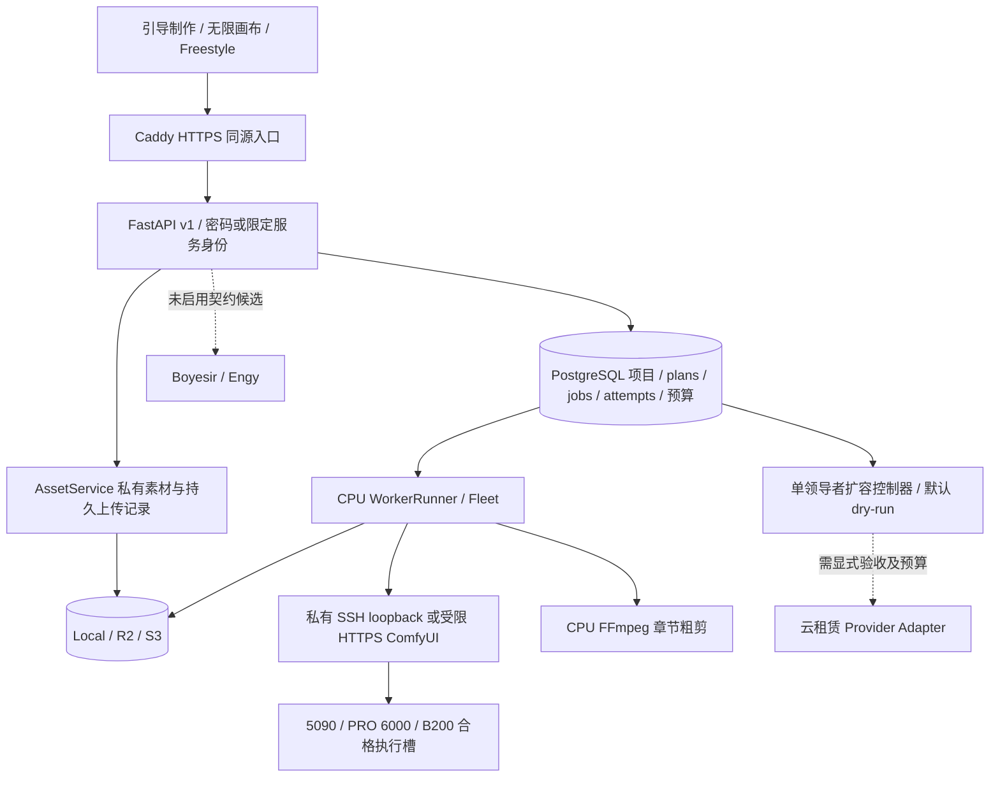

# Sixnine：映序与 H3 共用的制作平台

实施基线：2026-10-04，Australia/Sydney。本文件区分已经实现的代码、已验证的本地运行，以及仍需实际供应商验收的生产能力。早先 `LAUNCH-SCALE-NOVEL-PLAN.zh-CN.md`、`SIXNINE-READINESS.zh-CN.md` 是设计/账户核查历史；实现现状以本文件和本轮验收记录为准。

## 产品和部署决定

采用一套项目数据、素材、身份、能力定义、预检计划与任务账本。映序的引导流程、ReactFlow 无限画布、`/freestyle` 三种界面是同一业务模型的不同视图。ComfyUI 位于受控的模型执行层，不直接当作面向普通用户的主界面，也不允许浏览器提交任意可执行节点图。

主站使用 `https://www.sixnine.art`。`sixnine.art` 和 `h3.sixnine.art` 由同一 HTTPS 入口跳转，后者进入主站 `/freestyle`，避免两套 Cookie、项目与素材重复。已有 Namecheap 停放记录尚未修改。

网页/API/数据库先部署在一台常驻 CPU 主机，模块保持独立进程边界；任务数量本身不要求立即拆成微服务。部署包适用于 Linux Docker 主机，兼容用户提出的 Lightsail 起步；需要 AWS 工作负载身份与更精细隔离时，可把同一包放在 EC2，不建立两套生产数据。初期单主机是明确的可用性边界，并不等于高可用系统。

生产媒体首选候选 R2 Standard，AWS S3 保留同协议适配，Hippius SN75 保留实验适配。**当前实际运行使用独立 Local 存储**，没有切换旧用户数据、建立云桶或宣称线上读写已验收。选择依据和当前价格的来源见 [存储研究](HIPPIUS-STORAGE-REVIEW.zh-CN.md)。

## 组件与信任边界

浏览器只掌握本用户会话，不能得到供应商密钥、数据库口令或任意对象 key 权限。owner 从认证结果取得，不能从请求 JSON 取得。服务客户端只能操作预先绑定的项目和 scopes；不是共享 superdan 的 Cookie。

实际实现中 **CPU WorkerRunner** 读数据库和主存储，并经私有通道控制远端 ComfyUI。GPU 主机不持有数据库或主存储凭据；参考文件由 CPU 明确上传，结果由 CPU 收集。早期计划中的“GPU主动连接控制网关、直签对象读写”尚未实现，不能拿它描述当前网络流量或性能。未来若改为主动 worker gateway，需要独立身份、短期任务能力和对象权限测试。

API 与 CPU renderer 不持有云租赁权限。Fleet 只管理已配置的执行槽；启动进程不等于创建云实例。扩容控制器应有单独受限运行身份，不能靠同机不同 Python 进程声称秘密隔离。

## 一次制作与生成

1. 项目保存采用 v4 文稿与 `expected_version`，并发编辑返回冲突，保留本机稿，不静默覆盖别人。
2. 角色造型、场景、参考关系、脚本、镜头和画布位置保存在同一文稿。服务器对结构、类型、层级与引用校验。
3. 素材保存原件和派生件；浏览器显示的扩展名与时长不算校验。服务实际解码，验证格式、数量、时长、分辨率、字节数与哈希；长音视频明确选段。
4. 生成前先建立不可变 plan：确定实际 model、recipe、完整控制、实际帧数/尺寸、素材版本、来源快照和执行费用预留策略。
5. 用户确认 plan 后带幂等键创建 job。重复 HTTP 请求恢复原任务；修改镜头、角色造型或参考后，新提交须重新预检。提交前的来源校验不依赖浏览器手动递增版本。
6. 批次逐镜承认或阻止，保存每项 job ID 和原因。不会因为其中一项失败重新收费生成已接受的其他项。
7. worker 领取带 fence 的租约，先持久化提交意图再请求上游。失联属于 submission_unknown，先对账；不能直接重投以“提高成功率”。
8. 上游完成后收集、实际解码、验证并存储不可变 artifact。下载失败只恢复收集，不重新生成。最终下载仍检查 owner 与项目权限。
9. 候选回到原来源版本；用户明确采用后才进入当前镜头。旧版本结果可以保留，不自动覆盖后来修改的创作。

幂等针对有副作用的业务操作，不能仅缓存 HTTP 返回值；未知结果与确定失败有不同重试策略。这与 [AWS 的幂等重试原则](https://aws.amazon.com/builders-library/making-retries-safe-with-idempotent-APIs/) 一致。

## 章节成片与声音

独立 `chapter-roughcut-v1` CPU 配方按场/镜顺序，从“已采用视频”的确认入点截取指定镜头时长；未设置选段时从开头取片。选段绑定具体原文件，向内对齐24fps，用户明确决定保留镜头时长还是按选段调整。预检展示顺序、源区间、源时长、成片时长、画幅、清晰度、音轨与模拟来源。选择图片不能冒充视频，长度不足会阻止导出，不自动慢放、循环或缩短。新计划使用包含帧选段和可选字幕的v3契约；历史v1/v2计划匹配各自CPU配置，旧任务保留恢复路径，不能由新worker静默升级执行。

粗剪提供 480P/720P、16:9/9:16/1:1/4:3/3:4；最多 50 镜头、10 分钟、32 音轨。以上是本服务起步限额，不是 H3 模型上限。音轨显式选取源区间、时间线起点与增益；超出成片尾部的裁剪在确认前说明。视频自带原声不自动混入；静音方案会保留草稿音轨但不输出声音。有声成片同时生成独立 FLAC。

同一已完成生成任务的独立FLAC可以一键采用为对应镜头声音，服务端核对视频/声音的任务、项目和artifact身份；音频跟随视频选段，以累计24fps帧边界映射到32kHz样本，不能每帧重复舍入造成漂移。替换视频会要求重新确认；声音比选段短时阻止，不补静音伪装完整。此路径没有从MP4偷偷提取原声。

采用模拟视频的成片继续标注 SIMULATION。上传视频只代表用户上传，不证明由哪个模型生成。手动字幕支持编辑、人工校时确认、SRT导出和可选永久烧录；镜头来源、时长、顺序或音轨改变会使确认失效并保留原稿。v3烧录默认关闭，确认后由服务端读取已保存字幕，校验两行18字符、逐帧时间和固定版式；Linux使用带OFL许可的Noto Sans CJK SC，字体不可用则不登记为合格v3worker。Windows本机预览使用现有微软雅黑，不能据此保证与Linux像素一致。没有ASR或自动对白对齐。章节还能导出镜头CSV与只含稳定素材引用的JSON供剪辑交接。此粗剪不包含转场、响度母带或专业混音。见[字幕契约](CAPTION-BURN-IN-CONTRACT.zh-CN.md)。

## 并发、租机和收费

每个物理 GPU 执行槽先只运行一个模型任务。2 张 5090 独立运行可以是 2 槽；TP2 的 2 张卡是 1 槽。模型、recipe、精度/配置、实际设备身份都必须匹配。不同池不能把同一物理卡重复登记。CPU 粗剪使用独立 CPU 槽，不伪装成 GPU 容量。

队列领取、预算预留、实例 intent 都在数据库事务中持久化。耗时估算使用同配置样本，样本不足标低置信度；没有样本不捏造 SLO。扩容比较等待现有槽与新机冷启动完成时间，包含正在启动的容量；连续观测、冷却期、物理卡/实例硬上限与总预算同时满足才提出新实例。

扩容必须先记录并预留唯一创建 intent，再发一次供应商请求。超时留下未知实例并继续占用容量/预算，领导者切换后先对账，不能因为没拿到实例 ID 就再租一台。缩容先 drain，存在运行、取消未确认、收集或未知上游时不销毁。确认供应商实例已销毁后释放物理容量；账单未知时资金预留继续保留，待明确账单幂等结算。

当前真实云创建关闭、全局上限0。已实现`waiting_capacity`：只有独立有效的容量审批、报价、模型验收和预算均匹配，才可接收等待任务；同一审批关联唯一创建意图，验收就绪后原job继续排队。确认窗口与已确认任务等待截止分开，等待中来源改变会要求重新预检，实例未决账务继续保留。ColdStartCoordinator已用FakeProvider验证一次租赁契约，实际CLI只提供禁用、只读预览和消费已登记容量的推进模式；Lium boot/远端秘密尚未装配。此实现不等于5090、B200或公开零卡自动租赁服务已实测。

H3 plan 的金额是运营策略的**预算预留额**，不是已确认最终供应商账单。租机、任务计算与 API 供应商收费分别记账，不能把同一自建 GPU 成本同时作为供应商生成费重复扣除。账单未知不妨碍已校验成片下载，但保留账务待核状态。CPU 粗剪当前零额外用户收费也不意味着服务器没有成本。

## 存储和恢复

数据库保存稳定 asset/artifact ID、对象 key、大小、哈希和来源，不保存过期签名 URL。当用户请求私有媒体时先鉴权，Local 支持 HEAD/Range/206；云后端 GET 短签名跳转仍需要实际 bucket CORS 验证。

每个部署当前只初始化一个存储后端。适配接口不等于旧资产可以在线无缝换供应商；切换Local/R2/S3须另做对象迁移或双读路由、归属/字节核验及回滚方案。旧receipt的storage_binding只防止误改绑，并不会自动找到旧供应商中的文件。不能只改环境变量就期待旧Local素材继续可读；本轮没有搬迁作品。

当前网页上传经过 CPU 的 AssetService，较大云对象在服务端分片，有持久 receipt 与明确的未知写入核对。完整文件已接收后的服务端继续处理可恢复；浏览器中途断线的按字节续传、直签分片上传尚未实现。UI 要区别这两种“恢复”。

素材接收额度与实际解码内存分开限制。单个API进程内，视频预处理独占，图片/音频至多两路，FIFO等待最多30秒；这一范围覆盖选段、校验和归一化，不能通过恢复/衍生接口绕过。繁忙返回503/Retry-After，保留原件及同一素材收据，用户在素材列表恢复。已准备完成、仅需核对存储的恢复不会重新占用解码名额。部署固定单个Uvicorn进程；增加进程数不能当作免费增加这份内存预算。

参考视频保持显示尺寸与方向、24fps及原生帧网格（90度旋转会交换编码宽高），模型副本使用显式低缓冲H264编码；不宣称相同CRF就与旧medium压缩/画质一致。多轨原件完整保留，模型副本显式选择受检的首个实际视频/首个音轨，不能让FFmpeg默认挑另一个更大的轨绕过校验。单路容量与不可信解码器隔离仍须按最终Linux镜像验证，不能把成功的合成H264样本扩大为所有codec的保证。

Linux API素材预处理工具经独立解释器设置地址空间硬限额再以同PID执行：视频2.25GiB，探测与音频512MiB，禁用core dump。启动或设置限制失败不会无界重试，超时结束实际工具进程，错误不带素材路径或解码日志。采用独立解释器是为了避开多线程服务内的`preexec_fn`风险；`RLIMIT_AS`限制虚拟地址空间，不能称为整个容器的保活保证。[Python子进程说明](https://docs.python.org/3/library/subprocess.html)、[resource限制说明](https://docs.python.org/3/library/resource.html)。Windows开发没有这项OS限制；Pillow仍在API内，由像素上限与两路准入约束，尚非完整媒体沙箱。独立CPU粗剪worker的编码进程不在该API限额范围，仍需单独配置其容器资源并验收。

首轨绑定来自真实多轨旁路复现，并遵照FFmpeg的显式`-map`选择行为；手机视频的90度显示矩阵先计入显示尺寸，再按一致方向归一化和裁剪。[FFmpeg流选择](https://ffmpeg.org/ffmpeg.html#Stream-selection)。原件全部轨道和方向信息保持不变。

Hippius 当前普通 PUT 缺少项目所需的条件创建保证，不能直接替换 AssetService 的不可覆盖写入。保留实验 adapter，不用 HEAD→PUT 伪装原子写入，也不依赖未经证实的生命周期清理。若最终采用 Hippius，需要专门设计写入序号/状态账本、故障注入和实际读回，价格或 SN75 排放不是数据安全证据。

Local 与对象存储各有容量限额，暂存/工作目录不能当无限缓存。唯一素材、成片与未决上传不自动删除。已有SQLite一致快照+引用媒体备份/新目录恢复工具，以及PostgreSQL同一只读快照导出业务数据+Local媒体的便携备份，恢复到全新SQLite用于业务恢复/核对。排除认证秘密、保留owner和未知上游证据，未完成任务置为recovery_hold，容量审批关闭。隔离本机PG原生dump/restore也做过演练，但不等于生产PG一键恢复/PITR。数据库与媒体是不同恢复对象；同盘快照不算独立备份。异机加密备份、远端对象一致恢复仍未验收。见[备份契约](BACKUP-RECOVERY.zh-CN.md)。

## 发布与秘密

统一平台以单个测试镜像发布，固定依赖、非root API、私有PostgreSQL、Caddy唯一公网端口。GitHub手动production发布必须先配置固定出口runner；SSH固定主机密钥并调用预先安装的root控制器，不sudo incoming脚本。首次管理员bootstrap在终端隐藏输入密码，CI不能初始化账户。发布失败回退应用及代理配置，不回滚数据；普通应用发布禁止顺带改变DB/Caddy二进制digest。详见[发布契约](deploy/platform/RELEASE.zh-CN.md)。

供应商 API 凭据继续走中央 AI-Registry。远端 Linux 不能直接解密本机 DPAPI 库；需要中央维护的远端加载后端/工作负载身份，不能偷偷复制密钥到项目 `.env`。当前 AWS MCP 连接为 root，仅有账户核查证据，不作为应用或 CI 身份。

真实上线前须分别完成主机/区域/预算、正式密码初始化、非 root AWS 运行身份、远端秘密加载、私有桶权限/CORS/读回、DNS/TLS、独立备份恢复，以及真实推理池性能验收。缺这些不阻止开发本地功能，但不能把架构代码和本地演练写成已经上线。

## 架构复核后的取舍与升级条件

| 当前决定 | 为什么这样实现 | 何时再拆分或替换 |
|---|---|---|
| PostgreSQL同时保留任务事实与领取租约，暂不引入SQS/Redis | plan、预算、attempt与job可在短事务中关联，恢复时只有一份权威状态；当前按pool调度行串行化领取，再锁选中job | 若实测调度锁等待/数据库吞吐成为瓶颈，先改候选窗口与索引并测公平性；需要额外唤醒队列时仍保留DB事实和业务幂等 |
| 单业务API、单Uvicorn进程，GPU/CPU执行器分离 | 当前进程内上传/下载/媒体准入与内存边界有实测依据；GPU冷启动不影响项目查看 | 多API副本前要共享准入、资产操作锁与暂存绑定，并另验代理和恢复；不能只加workers参数 |
| 引导页、画布和快速创作共用文稿与API | 角色/场景/镜头引用不复制，参数预检和用户隔离只有一套 | 新专业节点必须映射已有或新版本配方；任意Comfy节点执行不开放给普通用户 |
| 成片只在实际校验和存储完成后公布 | 上游成功、收集成功和账单完成是不同状态；下载失败不能重新生成 | 后续直传对象存储需要短期任务权限与完整性协议，不能只让浏览器传一个已完成URL |
| 固定配方、控制包络和物理执行槽 | 5090、B200或第三方同名模型不能默认等效；避免把一张卡重复计为多个空闲池 | 每种型号/精度/参考组合独立证明控制完整性、速度、费用和失败范围，再注册池或供应商路由 |

SQS标准队列可能重复投递，换成托管队列并不能省掉业务幂等和未知提交对账。[AWS投递语义](https://docs.aws.amazon.com/AWSSimpleQueueService/latest/SQSDeveloperGuide/standard-queues-at-least-once-delivery.html) PostgreSQL的行锁和`SKIP LOCKED`适用于特定队列访问，但跳过锁定行不提供通用一致视图；当前普通领取为了owner公平性使用pool锁，过期租约扫描才使用skip-locked，不能泛称全系统已实现无锁并行调度。[PostgreSQL17锁定说明](https://www.postgresql.org/docs/17/sql-select.html#SQL-FOR-UPDATE-SHARE)

当前并发请求准入不等于业务积压总量上限。队列候选已避免载入大JSON，但一次领取仍排序该pool的候选标量；尚未验证百万任务、跨区域或高可用规模。启用更大规模前还需按真实积压测调度耗时、设运营接单上限并设计长期业务记录容量，不能把本机读API压力数据当GPU吞吐或无限接单能力。现阶段目标是两个测试账户可核对、可恢复的制作平台。
