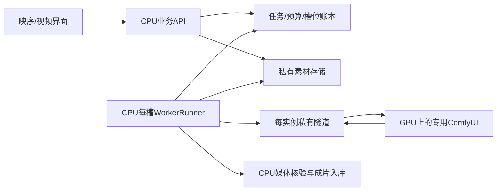

# CPU控制面与多槽执行

2026-10-04。`studio_platform/fleet.py`。默认disabled、max_children=0，不建立SSH隧道、不下载权重、不调用provider租机/销毁API。测试只用临时数据库、fake进程句柄、注入CPU/backend/store，没有新启动真实GPU或长期fleet进程。

## 拓扑

WorkerRunner保留在CPU控制面成立，无需先开发GPU直连任务数据库的HTTP网关。CPU节点运行API、账本、每槽worker、素材读取/规范化及FFmpeg输出核验；GPU实例只运行受限ComfyUI。CPU通过逐实例独立SSH loopback隧道访问Comfy，或使用已核实私有HTTPS网关。SSH钥匙、API key、数据库与存储凭据均留在CPU的受权运行环境，fleet manifest不存这些值，GPU不接收它们。



前端只使用业务API，不连接原生Comfy端口，不传任意node图或供应商凭据。此结构增加CPU与GPU之间素材/结果传输以及CPU转码负担；后续应测并发CPU、网络和存储成本，不能只看GPU推理时间。fleet不宣称建立好了私网或验收了实际模型。

## 公共Python接口

- `SlotConfig(spec:WorkerSpec,enabled=False,endpoint='',allowed_origins=(),comfy_revision='',confirmed_idle=False)`：精确实例/物理卡/pool/model/config/recipe绑定。真实origin不得含认证、query或path；HTTP仅loopback，远程为明确HTTPS。allowed_origins必须只有完全相符origin；实际Comfy revision为40位小写commit。重复GPU、worker或endpoint拒绝。
- `FleetConfig(work_dir,slots=(),enabled=False,max_children=0,shutdown_grace_s=210)`：显式绝对工作目录，最大32子进程。enabled时至少一个明确启用槽且不超max_children；CPU模拟与真实槽不混入同一fleet。
- `read_config(absolute_path)`：仅受信操作员JSON（Linux禁止组/其他用户写），最多256KiB，拒绝未支持字段。`fingerprint()`覆盖所有manifest值；子进程验证父进程传的hash后才加载Settings，启动间配置被编辑会安全退出。
- `FleetSupervisor(config,repo,config_path,popen=...,clock=...,sleeper=...)`：`start/tick/drain/shutdown/run_forever`。默认不动DB、不建目录、不spawn；启用后全槽先通过持久Control登记/跨池总容量，再启动独立CPU子进程。PID来自本次创建的Popen句柄，保存的历史PID不作为发信号依据。
- `run_slot(config,worker_id,settings,repository=None,store_factory=...,backend_factory=None,runner_factory=WorkerRunner,once=False)`：子进程执行接口；factory用于隔离验收。Settings的backend与generation_enabled必须明确匹配。真实首次/失联空闲恢复需confirmed_idle声明及当前private `/queue`确认为空；不能靠历史benchmark或进程活着假定就绪。已有未结束current_job只核对原attempt。

每槽独立`work_dir/<worker_id>`；数据库和store沿用CPU Settings，同一API/worker必须指向同一账本和私有objects。model/config/recipe的登记精确匹配不构成模型权重的密码学证明，实际模型/硬件资格须独立验收并由执行策略引用。

R2使用与现有API相同的S3StorageConfig与中央load_storage_credentials入口；不复制加载器或.env。Linux/AWS必须另有受权可用的运行时凭据适配，Windows DPAPI库不能因为挂载文件就当作可在AWS解密。其他远端store需明确注入已审阅adapter，不回退默认AWS账户。本轮只验证本地/fake存储；单PUT限制100MiB仍适用，大输出由ArtifactWriter使用已有持久multipart receipt/配额链分片并核验。分片代码与离线测试不代表512MiB全部输出已在远端实际验收。

## 新提交的资格门槛

`WorkerRunner(...submission_guard=callable,stop_requested=callable)`：真实Comfy默认未提供guard时拒绝新提交。准备前与紧邻begin_submission前各核验一次，CLI/fleet接`ExecutionPolicies.submission_allowed(job)`，重新检查真实策略/model/config/hash、资格与报价期限，但不把已预留预算再计算一次。检查失败在确未提交时失败并释放预算，error_code为execution_policy_unavailable_before_submission。running/unknown/collecting恢复沿用原attempt，不因新报价/资格变化重新提交，也不会阻止合法成片收集。Mock为明确CPU模拟例外，始终标识SIMULATION。

Fleet只运行被任务计划指定的池；它不会自动将5090、96GB卡、B200互换或套用另一配置。现执行策略只对明确已验收pool/config准入；多GPU登记不代表不同硬件配置都获得资格，不自动改变模型、画质、参数或价格。

## CLI与退出

受信manifest的最小安全形态（仍需使用当前主机的真实绝对目录）为：

```json
{"version":1,"work_dir":"/data/fleet","enabled":false,"max_children":0,"shutdown_grace_s":210,"slots":[]}
```

每slot字段为worker_id、pool、provider、instance_id、physical_gpu_ids数组、recipe_ids数组、model_id、configuration_id、backend、enabled、endpoint、allowed_origins数组、comfy_revision、confirmed_idle。字段名不能加API key、DB URL、SSH key或密码；凭据使用Settings已有FILE/中央加载入口。

```text
python -m studio_platform.fleet --config /data/operator/fleet.json
python -m studio_platform.fleet --config /data/operator/fleet.json --request-drain
```

首个命令只有明确enabled才启动CPU子进程。`--slot ID --once`供明确单次阶段验收；supervisor不支持--once后遗留无人管理子进程。--request-drain只写本fleet的supervisor-drain.flag，既不加载数据库/存储凭据，也不读取/杀历史PID；适用于Windows没有可靠SIGTERM投递的后台进程。该标记保留，重新启动前须操作员核对任务并明确重置这一生命周期标记，不能用泛化清理命令删除资产。

POSIX同时向本次仍活着的子进程发送SIGTERM；Windows用drain.flag，由worker在循环/阶段心跳核对。子进程无可见窗口，stdout/stderr不采集原始响应；安全状态写fleet-state.json，只含worker_id/PID/exit_code/state。正常idle续已有效注册心跳；过期或unknown不因进程存活而自动复活。

drain停止新claim并保留current_job、fence、预算和上游ID；标记跨失联/当前任务完成保持。shutdown最多等待配置grace，超时返回drain_pending，不谎称完成、GPU空闲或云实例已停，也不盲杀未知PID。当前FFmpeg/HTTP阶段各有超时，完整收集可能超过210s；grace按部署和输入包络配置，超时由操作员/容器控制面继续核对。

子进程退出不自动重启，也不释放设备登记或云预算；管理员可按原worker重新启动以核对，不创建新生成/新GPU。停止CPU进程、drain/retire、删除目录都不会停止GPU供应商计费，云TTL/销毁核验属于独立控制面。默认创建仍为0。
# CPU 章节合成槽补充

`cpu-render` 可与真实 `comfy-worker` 共用 CPU 控制主机，但模拟 mock 仍独立。CPU SlotConfig 没有 endpoint、allowed origins 或 Comfy revision；明确 `provider=local-cpu`、`model_id=sixnine-chapter-roughcut-v1`、`recipe_ids=(chapter-roughcut-v1,)`、`physical_gpu_ids=()`。新作业 `render.version=3` 精确匹配 `configuration_id=cpu-render-v3`，默认无字幕，可显式烧录已经确认的字幕；历史 v1/v2 收尾 worker 必须分别使用 `cpu-render-v1`/`cpu-render-v2`，三种配置不能互接。`platform_cpu_slots` 将一个 CPU instance ID 固定给一个 worker，不能用不同 worker ID 无限重复注册；同实例升级须先以原身份和工作目录收完旧任务再退役，或使用另一 CPU 实例。CPU 不占 GPU 全局 gate 或 registered_devices。

CPU 子进程需要独立 `Settings.render_enabled=True`，不复用 H3 generation 开关。它使用相同 auth/预算/recipe/submission guard、隔离 workdir 和 drain 机制；CPU 生成不默认联网。章节范围 1..14400 帧/24fps/≤600秒，偶数尺寸 256..1280、像素≤921600；完整 collection decode 的 timeout≤1800秒，阻塞媒体阶段续租。只给当前 CPU attempt 发取消，GPU running 取消仍遵循原 Comfy 安全契约。

fleet内建CPU backend使用固定noto-cjk字体profile；有字幕作业需要Linux镜像中已配置的Noto Sans CJK SC/libass环境，worker登记不代替字体验收。Windows的已有微软雅黑测试引用仅由独立render_cli显式选择windows-yahei，fleet manifest不接受用户字体路径，也不会自动复制/下载字体。v3生产资格应包含实际中文烧录验收。
