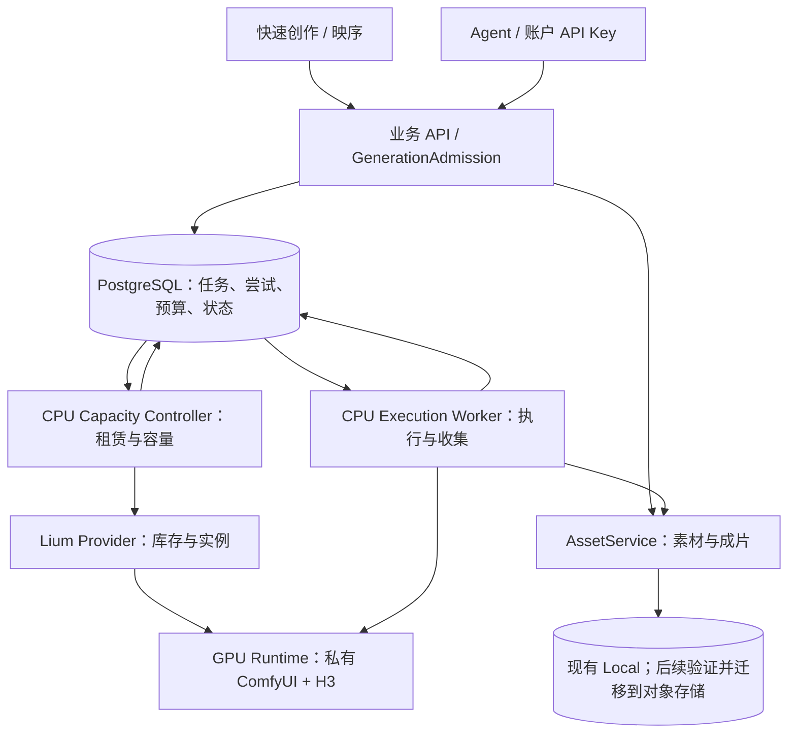

# Sixnine 生成平台：架构收敛与可靠性实施顺序

日期：2026-10-06，Australia/Sydney。

后续完整规划入口：[统一业务 API、生成后端与部署规划](UNIFIED-BACKEND-API-PLAN.zh-CN.md)。本文件保留本次可靠性审查的历史依据；后续API、技术栈与工作包决策统一在新规划中维护，避免两份方案独立漂移。

状态：依据现有代码与历史回执整理的架构建议，供本轮确认和后续开发使用；不是已部署声明。本轮仅只读审查并写本文，未变更代码、部署、预算、授权期限、GPU、任务或素材。本文不授权租赁、恢复过期服务窗口或付费测试。

## 1. 本轮目标与决策范围

用户明确调整优先级：先敲定后端、Worker、GPU 调用和存储的分工，先让网页和 Agent 都能可靠地获得真实视频，再推进前端功能和更大规模扩容。

优先交付物是“一条可追踪、可恢复的真实生成链路”。保留已批准的快速创作 UI 与另一个会话完成的本地集成；只为展示真实服务状态修改必要接口。SDD 框架可以在架构和合同确定后管理工作，不作为修复链路的前置工程。

本文在可靠性范围内承接 `ARCHITECTURE.zh-CN.md` 和 `SYSTEM-DESIGN-DUAL-GPU.zh-CN.md`。这些文件中的运行状态有日期，不能当作实时健康信息。已批准 UX 继续以项目 AGENTS 与 mock 为依据；本文不重新设计界面，不复制完整业务规格。

## 2. 已核对的事实

| 内容 | 本次确认范围 |
|---|---|
| 持久任务与预算 | 已有 SQL jobs / attempts / artifacts / 预算预留 / outbox；有幂等、领取租约和 fence；不是待从零引入队列 |
| 业务入口 | 现有 `GenerationAdmission` 承担预检、创建及入队；Quick Chat 本地适配复用它，不是另一套 GPU 后台 |
| Worker 部署位置 | CPU 侧 `WorkerRunner` 经私有通道调用 GPU 上的 ComfyUI；GPU 不直接访问业务数据库 |
| 输出成功条件 | Worker 下载、验证并持久化成片后才完成任务；已有收集恢复机制 |
| 历史线上成功 | 旧策略有真实 user / Agent 任务、视频与音频下载、Range、空闲停机证据；不能据此否认已有成果 |
| 最新策略证据 | 2026-10-05 的 `queued-task-first-v1` 发布回执存在；新策略冷启动、15 秒性能和质量尚无实际验收 |
| 运行窗口 | 最近记录只到 2026-10-05 23:45 Sydney，当前已是 10-06；旧 ready 回执不再足以证明可用。本次没有实时查询，因此不判断当前控制器已经停止 |
| 双机与持久存储 | 当前按需控制器代码仍限定单实例；按需双机、模型持久缓存、业务素材 S3 迁移均不能写成已完成 |

历史故障提供了具体方向：固定 offer 失效与创建结果不明、权重下载盘实际容量不足、旧开机资格视频耗时，以及策略/控制包络限制。某些已被修复，下一步应核验新链路，不能把历史原因都当作当前未修问题。

## 3. 建议确定的系统边界

保持模块化业务后端，执行与容量控制独立进程。先使用现有 PostgreSQL 持久队列，不为这轮可靠性工作引入 SQS、Redis、Kubernetes 或第二套业务数据库。

| 模块 | 唯一主要职责 | 不应承担 |
|---|---|---|
| 业务 API / Admission | 账户权限、素材归属、能力校验、不可变执行请求、预算准入、幂等接单、状态和结果查询 | 租机、在 HTTP 请求中等待整段推理、根据前端传来的 owner 授权 |
| SQL 队列 / WorkerControl | 持久任务事实、唯一领取、执行槽匹配、租约与 fence、合法状态转换 | 用进程内列表代替任务账本、把心跳超时直接当作上游失败 |
| CPU Execution Worker | 领取任务、输入传输、调用推理、执行对账、结果收集校验与持久化、报告阶段 | 选择并购买云实例、自己扩预算、改写用户草稿 |
| Capacity Controller | 库存条件筛选、持久租赁意图、租赁预算、启动与就绪、隔离、排空、空闲关闭和费用对账 | 修改 prompt、伪造任务成功、把一个节点失败扩大为全池不可用 |
| GPU Runtime / Comfy 适配层 | 固定版本和模型执行；暴露状态与输出；按任务身份对账 | 持有主数据库或云账户全权凭据、向浏览器开放任意节点执行 |
| AssetService / Storage | 私有输入和输出的归属、版本、完整性、读写和恢复 | 用签名 URL 当永久素材 ID、把 GPU 临时盘当成唯一成片存储 |

API、Worker、Controller 可以先在现有 CPU 主机上独立运行。独立进程便于重启和发布，但不是已经具备高可用或凭据隔离；进程权限、秘密挂载、资源限制要分别落实。单 CPU 主机仍是已知单点。

## 4. 三套状态必须分开，网页读取同一事实

下表是合同语义，不直接重命名现有数据库枚举；实现前建立现有字段映射，保持兼容。

| 对象 | 必须表达的事实 | 权威持久化与推进者 |
|---|---|---|
| 用户 job | 已接收、等待容量、等待执行、执行中、收集中、成功、取消中、失败或待核对 | SQL；Admission 接收，Queue/WorkerControl 与 Worker 按受限转换推进 |
| execution attempt | 本次请求快照、领取身份、提交意图、上游 ID、是否未知、执行结果和收集回执 | SQL；Worker 通过租约与 fence 更新，不覆盖其他尝试 |
| GPU lease / worker | 租赁意图、创建未知、启动阶段、运行环境就绪、健康/隔离/排空、销毁与结算 | SQL 与供应商事实；Controller 对账与推进，worker 健康独立记录 |

租机成功不等于模型就绪；环境就绪不等于这个参数组合已推理成功；GPU 完成不等于视频已保存；销毁完成不等于最终账单已确定。

面向用户的 API 至少能解释：当前 job 阶段、进入阶段的时间、最近进展、安全错误码、是否自动恢复、建议用户动作。运维侧关联 job / attempt / worker / lease / release ID。租赁细节和其他用户信息不直接公开；不记录用户媒体、prompt 或秘密到通用诊断日志。

已有安全等待原因继续复用。需要扩展时增加结构化字段，不让各前端通过匹配中文文案猜状态。页面和 Agent 使用同一查询结果；刷新或重连不提交新任务。

## 5. 一次生成的固定流程

1. 用户或 Agent 通过现有业务接口保存材料与生成草稿。聊天助手调用有自己的费用边界；保存草稿不会提交视频计算或租 GPU。
2. 用户点击开始生成或 Agent 显式提交时，服务端核验当前能力、素材、版本和费用约束，在事务中接收唯一任务。永久无效或授权过期不能显示成已正常排队；暂时无健康容量但有有效启动许可时可接收等待任务。
3. Controller 先恢复已有活动/未知租赁，再为真实需求建立唯一租赁意图并条件选机；请求结果不明时只对账，不再租第二台来掩盖未知结果。
4. 启动检查验证实际磁盘挂载与空间、源码/模型版本、依赖、GPU、私有连接及队列状态。完成后登记可服务槽，原任务继续。按已有新策略直接执行用户确认任务，不每台先生成三段资格样片。
5. Worker 原子领取任务和槽，持久提交意图，调用 Comfy；超时按提交阶段分类。只有明确未提交或有可靠终止证据，才能进入允许重试的分支。
6. 推理完成后持续收集、解码验证和保存结果。下载/存储失败只恢复收集，不重新生成。同一任务在 API 和网页看到同一成片。
7. 任务成功后，实例还可处理下一单。全池无运行、收集、未决取消和未知执行义务后连续 600 秒，Controller 才排空并关 GPU；计费对账继续独立处理。

## 6. 优先解决的可靠性问题

### A. 生产服务生命周期与有限测试窗口分离

当前有限控制器的历史成功不等于可长期服务。设计上 CPU 控制器应作为受监督的服务独立于桌面会话；运行权限、预算和租赁上限有明确状态与到期行为。测试期限不应无提示地使网站继续表现为可正常接单。

这不意味着本轮自动取消截止时间或提高预算。先只读核对当前生产回执、控制器、队列与租赁，再在实际部署步骤明确运行政策。旧任务、未知租赁、累计费用和已经保留的资金不能因换版清零。

### B. 启动使用统一执行配置，避免每层各自猜默认值

已有 recipe / model / 控制包络 / execution release / worker 指纹继续作为基础。确定一个受版本管理的执行配置来源，由准入、启动检查、Worker 和能力查询共同消费；前端可选项来自该能力查询。

例如 `tiled/cpu` 等运行参数应由执行配置一致确定，不要求普通用户猜对才能提交。不能以“自动兼容”为名静默改变用户清晰度、时长、模型或参考用途。正式暴露的参数要在 API 校验、编译后的工作流和执行结果证据间可追踪。

### C. 未知执行的恢复边界要真正闭合

代码已有 submitting、submission_unknown、reconcile 和 fence。当前 ComfyBackend 通过有限 history 与 queue 搜索 attempt tag；runtime 重启或历史淘汰后，可能无法证明旧执行状态。这是需明确解决的边界。

优先评估推理侧持久化 attempt 接收/状态/输出回执及可查询接口；与 CPU 账本共同恢复。仅增加一个收据文件不能承诺 exactly-once，还要处理收据写入与真正提交之间的中断。无法确定的尝试隔离并显示具体原因，通过可审计恢复操作处理；禁止直接 failed→queued 或跨机重投未知任务。新的恢复接口须有 fence、预算和终止证据校验。

### D. 启动时间按阶段测量，按主要耗时优化

分别记录分配实例、系统启动、依赖准备、权重下载、模型加载、输入上传、去噪、解码、结果收集时间。历史 48 分钟不能当成新策略固定耗时，也不能在新策略未测时承诺几分钟。

固定发布产物、模型清单与缓存路径。持久卷或模型镜像缓存需先验证供应商能力、真实容量、版本和费用；不把临时 pod 缓存写成持久缓存，不在每次启动临时安装浮动依赖。

## 7. 实施顺序与完成门槛

| 顺序 | 工作包 | 完成依据 |
|---|---|---|
| P0-1 | 当前部署与执行合同对齐 | 有日期的线上只读核验；区分实现版本、部署版本、当前控制器/许可和已实测范围；单一 release/能力配置贯通接收与执行 |
| P0-2 | 单执行槽真实闭环 | 同一 job 经公网 API 接收、从零容量启动、执行、保存、下载成功；暖机下一单继续成功；状态原因可查询；按需空闲关闭再起能恢复正常服务 |
| P0-3 | 中断与恢复闭环 | 重复提交、Worker 重启、提交结果未知、收集失败、取消未确认、库存不足、期限/预算阻塞分别有确定行为；无重复租赁、执行和扣款；需要人工处理的情形明确显示 |
| P1-1 | 启动与输入配置可复现 | 固定环境与权重清单；实际磁盘容量检查；阶段时间证据；首尾帧和参考模式真实任务结果；4–15 秒与多模态的支持范围逐项标 implemented / enabled / verified |
| P1-2 | 双机按需及局部故障隔离 | 用户已要求目标 2 / 最低可服务 1，先就绪先接单；一台失败不封锁另一台；原任务不双投；预算/成员/lease 独立对账。先验一个槽只是实施步骤，不取消最终双机目标 |
| P1-3 | 资产备份恢复与对象存储 | 当前 Local 的独立备份和恢复先验收；对象存储的私有读写、校验、CORS/Range、旧素材迁移和回滚另验。不能只改环境变量导致旧素材失联 |
| P2 | 按负载继续扩容和外部 API 路由 | 基于已测冷启动和吞吐扩容；先验证供应商参数与控制等价性；未经验证不自动把 H3 任务切到 Engy/Boyesir |

P0 完成不意味着所有 H3 功能或所有 GPU 型号已经验收。第一条真实闭环选现有支持配置；后续覆盖对外承诺的每种输入和控制，不能靠缩减能力掩盖问题。

离线合同测试与故障注入先合并运行；真实推理使用用户明确确认的队列任务，成功直接交付，不复制任务当测试。真实租赁/推理前核对当时有效的授权、预算与窗口，按既有发布规则执行。以受影响路径验收，不每改一个字段都跑全部 CI。

## 8. 开发会话的分工

- 架构/集成负责人：维护本次确认的边界、接口变更、验收矩阵和发布证据；以同一任务的完整结果验收。
- 后端执行负责人：Admission、队列、Worker、输出收集与任务查询；不另造租赁逻辑。
- GPU 生命周期负责人：Provider、bootstrap、就绪登记、Controller、实例对账和按需关闭；遵循同一任务与执行配置。
- 前端负责人：保持批准的 mock，消费同一能力和任务状态接口，必要时补进度/错误反馈；生成闭环稳定后继续体验扩展。

涉及共享模型或接口先提交小型合同变更，确定兼容与迁移后再并行实现。框架若采用，只索引这些已确认约定、任务与验收，不再自动生成一套相互冲突的系统设计。

## 9. 证据入口与核验边界

- `studio_platform/generation_admission.py`：业务准入与任务创建。
- `studio_platform/repository.py`、`queue.py`、`control.py`：SQL 事实、领取与恢复。
- `studio_platform/fleet.py`、`worker.py`：CPU WorkerRunner、Comfy 调用、未知提交与收集。
- `studio_platform/on_demand_scaler.py`、`queued_task_runner.py`：有限单机控制器、新策略和结果证据。
- `.platform-demand-live/NEW-START-STRATEGY-RESULT.zh-CN.md`：2026-10-05 新策略发布、旧任务保护、未实测项与运行期限。
- `.platform-demand-live/GPU-RECOVERY-HANDOFF.md`：库存、磁盘、启动耗时等历史故障与修复证据。
- `SYSTEM-DESIGN-DUAL-GPU.zh-CN.md`：双机目标、成员隔离与尚未实现的范围。
- `DEVELOPMENT-RELEASE.zh-CN.md`：前端/API/执行协议的发布边界。

中央目录本次只查询了资源与 profile 元信息。Lium、Sixnine 的历史登记不证明此刻可用；没有加载或输出 API 秘密，也没有调用供应商。当前工作树还有其他会话的修改，本轮不覆盖、不提交、不迁移。

参考原则沿用已核查的 [Google 创作平台模块化架构](https://github.com/GoogleCloudPlatform/gcc-creative-studio#system-architecture)、[AWS 异步生成模式](https://aws.amazon.com/blogs/compute/part-2-serverless-generative-ai-architectural-patterns/) 和 [AWS 幂等重试原则](https://aws.amazon.com/builders-library/making-retries-safe-with-idempotent-APIs/)。参考架构不能代替上述部署与真实结果验收。
