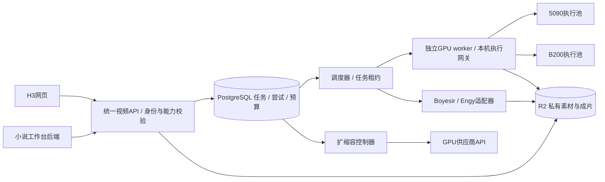

# H3 视频服务上线、GPU 扩容与小说工作台整合计划

后续实现更新（2026-10-04）：本文件保留初始计划。最新实际数据流、身份边界、媒体流经CPU而非GPU直传、统一域名及已实现功能见 `ARCHITECTURE.zh-CN.md`，不要把此处未来方案写成已运行架构。

日期：2026-10-04，Australia/Sydney。性质：可实施计划，**未部署、未租 GPU、未开启自动扩容、未改当前运行服务，也未修改小说项目**。

2026-10-04后续就绪核查：用户确认网站域名为`www.sixnine.art`；AWS MCP的STS身份查询已成功，但未部署。考虑外部GPU与视频下载，媒体存储建议更新为Cloudflare R2 Standard，S3保留为可选后端。详见`SIXNINE-READINESS.zh-CN.md`，不是宣布存储已经切换。

## 1. 产品与架构决定

将 H3 Studio 建成独立视频生成服务。用户已确认小说项目就是**映序**。现有 H3 网页和映序都是它的客户端，共用素材校验、生成能力、任务账本、执行池和结果存储。映序保留人物、剧情、章节、场景、分镜和剪辑；不再独立租 GPU 或另写一套 H3 执行器。

实际推进顺序：**统一 API 与持久任务 → 单卡5090验收 → 两个5090 worker并发 → 自动扩容演练 → 小说单镜接入和章节批量 → B200成本/速度对照**。小说数据桥接可与5090工作并行设计。通过阶段门槛再扩大投入。

正式主线建议 AWS EC2 CPU + Docker，复用现有应用镜像；PostgreSQL 保存任务，Cloudflare R2 Standard私有桶保存素材与成片，保留S3兼容存储适配层；GPU 首先使用已有供应商渠道的独立5090 worker。B200使用相同worker协议，供应商不锁定AWS。此处是建议调整原Lightsail目标，尚未创建/切换。

理由：原Lightsail方案针对两人CPU预览；现在还需要AWS运行身份、对象存储、扩容控制器和服务间认证。EC2原生工作负载身份更适合这一主线。若先沿用Lightsail，只开放正式登录、上传和历史浏览的小规模预览；不为过渡同时维持两套生产站点。当前Docker/Caddy打包可复用，ECS留待应用层真的需要多副本时。

初期PostgreSQL可与应用在一台EC2上使用独立持久卷，明确单机故障边界，先完成异机备份/恢复；需要更高可用性时迁RDS。预算足够也可直接选RDS。SQS初期非必需：先由PostgreSQL领取任务；以后增加SQS作为唤醒/投递层，数据库继续作为事实来源。模型权重不放网页镜像或GitHub。

## 2. 现有资产和缺口

| 部分 | 真实状态 | 本轮之后要补的内容 |
|---|---|---|
| H3网页、上传、真实生成与下载 | 已有单机实现及历史成片；GPU目前已销毁 | 抽出执行后端；不靠打开网页证明GPU在线 |
| 账户 | 已实现superdan/supervan隔离及密码模式；公网真实密码仍未建立 | 稳定用户ID、正式账户初始化、服务客户端身份和项目授权 |
| GitHub/CI | 私有仓库apedintensor/h3-studio，已有CPU构建与离线测试 | EC2目标发布、工作负载身份、生产配置与恢复演练 |
| Lightsail包装 | Docker/Caddy/手动CI发布配置已有，未真实上线 | 部署目标确认；复用应用镜像，不直接启用旧本地GPU控制 |
| 当前任务 | SQLite、进程内worker、Comfy loopback | PostgreSQL、独立worker、attempt/lease、提交不确定与下载恢复 |
| H3控制 | 现有网页/API共用校验器，部分组合有真实验收 | 全部已实现控制进入版本化能力表；未测组合保留实验标记 |
| Boyesir/Engy | 已完成公开契约核查，未接实际adapter | Boyesir逐型号验收；Engy创建/返回schema仍不足；鉴权与预算另验 |
| 小说项目 | 用户已确认映序；现有原型以浏览器本地数据为主 | 先补云端项目/用户/素材持久化，再接真实生成；《水声未静》制作包可作验收案例 |

既有证据：`AGENTS.md`、`LIGHTSAIL.md`、`SCALING.zh-CN.md`、`CONTROLS.zh-CN.md`、`RESULTS.zh-CN.md`、`API-PROVIDER-COMPATIBILITY.zh-CN.md`。旧文档里“GPU继续运行”是历史说明，以最新销毁记录为准。

## 3. 上线拆分与身份

### CPU控制层

- API负责登录、owner/项目权限、上传授权、输入预检、能力匹配、预算和状态查询；HTTP请求不等待GPU生成结束。
- 独立scheduler/dispatcher负责领取，provider poller负责外部API状态，collector负责下载/解码/保存；这些初期可以同一代码库、同一CPU主机上的独立进程。
- GPU worker主动连接我们的HTTPS控制面，只获得被分配任务、有限期素材读/结果写权限。没有数据库口令、全桶访问、云租赁主key或其他用户文件清单。
- 自托管ComfyUI/SGLang端口仅供worker本机使用；用户、小说网站不直接连接模型端口，也不能提交任意可执行节点图。
- PostgreSQL使用租约、事务、唯一约束；素材改为对象ID，不再依赖Windows绝对路径。原始文件与裁剪/归一化派生文件分别记录。

### 正式登录、服务调用与秘密

H3网页继续提供正式密码登录。小说后端使用独立M2M客户端身份，绑定允许的tenant/项目与操作范围；不能共享superdan Cookie，也不能靠请求里的owner字符串获得权限。浏览器没有供应商key。

MVP可采用可轮换的服务API凭据，后端验证客户端后再做项目/用户映射；增长期可换短时签名委托token，验证issuer、audience、期限、scope和映射，不改变视频业务API。使用者、来源项目与付费账户是三个不同字段。

本机API认证继续复用中央 `api_registry.load_api`；AWS运行时拟使用Secrets Manager引用和EC2实例角色。Windows DPAPI不能直接复制给Linux解密，需中央加载器维护方支持对应运行时入口/后端，再在受控进程内迁入批准的服务字段。未完成前保持该adapter禁用，不复制加载器源码，不新建明文项目.env。

实例角色不是同机进程的权限隔离。P0–P3尚未开放自动租机，应用实例角色不授租赁主凭据读取权限。P4开放控制器时，优先把它放入独立小型EC2身份边界；之后也可用独立ECS task role。若为节省成本与API同机，必须先实现受限本地凭据代理、阻断普通容器访问IMDS并验证隔离，不能仅凭“不同进程”声称安全；在此之前控制器保持dry-run。无需为P0预先购买控制器主机。

CI后续使用GitHub OIDC取得部署角色的短时AWS权限，并限制仓库、实际subject格式、分支/production environment；它不替代网页用户登录，也不等于SSH身份。EC2发布可走SSM/ECR，沿用固定镜像digest。第一次发布手动触发，稳定后再改main自动发布。

发布前先阻止新任务进入、drain并核对仍在执行的上游任务，不能只检查一次空队列就更新。数据库用向前兼容迁移；代码回滚不覆盖新增用户作品。做数据库与媒体两种备份，并实际恢复测试。

## 4. GPU池：并发与单任务加速分开

**2张5090各自执行1个任务 = 2个并发槽；2张5090组成一个TP2执行组 = 1个并发槽。** 第一轮验证前者。每个单GPU worker先限制1个生成任务，不因为显存有空余就直接加并发。

| 逻辑池 | 能力 | 引擎策略 |
|---|---|---|
| Base-FL | 文生音视频、首/尾帧 | 原版H3；单5090先复现公开基线，再测产品分辨率/时长 |
| Base-Ref | 图片、视频、音频混合参考；已封装高级控制 | 先保留已通过验收的Comfy路径；SGLang按控制项映射验收后选用 |
| VDN-FL快速模式 | 文生、首尾帧 | 独立模型/配方；当前SGLang不接Ref2VA，不能自动替换Base-Ref |
| 外部API | 各供应商/型号确认支持的子集 | 用户允许的服务商与预算范围内选择，不省略不支持的参数 |

分组键包含模型revision、variant、精度、attention、采样设置、GPU型号/拓扑、主机RAM和缓存状态。FL/Ref频繁切模型会增加加载成本，按任务积压维持适合的worker，不让每个任务都从头下载/加载。

5090有32GB显存，公开单卡480p/20步基线可作为部署入口，不证明所有768p/15秒/混合参考都能达到产品要求。未通过的配置明确不向该池路由；需要更大显存时转入用户允许且已验收的更大卡池，不能暗中降清晰度/删参考。

B200先测**单卡替代单卡**，再比较“2个独立单卡worker”与“1个双卡worker”的合格成片吞吐、单任务延迟和成本。网站高并发通常需要多个独立槽；长任务低延迟才考虑多卡协同。精度/模型/步数变化单列，不能冒充纯硬件收益。AWS的p6-b200.48xlarge是8卡实例，不能按一个B200的预算去启动整机；GPU租赁粒度、区域与实时价格在实际采购前确认。

## 5. 扩缩容规则

以下均为**建议试点参数，未实测、未启用、不是租赁授权**：当前GPU开关关闭，控制器dry-run，所有云创建上限为0。以后获明确测试预算后，5090上限先设2张物理卡；B200上限仍为0，单独批准后才开放。

扩容看：就绪任务的预计运行时间、最老任务等待、各worker剩余工作、正在启动worker的预计就绪时间、单任务输入要求、预算。不能用“队列超过5条就加卡”，也不能按5090/B200卡数直接折算容量。

1. 每30秒按模型/尺寸/帧数/参考规模/采样步数/GPU类别查耗时分桶；样本不足时用已观测最大值×1.25并标低置信度，数据充分后用滚动p90。无同类样本的配置不自动宣称可满足SLO。
2. 将ready/busy以及starting的预计ready时间放入排程，模拟当前任务开始/完成时间。starting计入未来容量，不算立刻可用。
3. 连续两次预测排队超5分钟，且新实例含冷启动后能带来至少2分钟完成时间改善，才提出扩容。一次最多新增1台，5分钟扩容冷却，同时核对数量和预算。冷启动比等现有卡更慢时不为这批任务加卡。
4. 受任务、用户、全局预算和最大卡数共同约束。已启动/闲置/排空中/状态未知但可能计费的实例全计入，不只数正在推理的卡。无预算配置时保持dry-run。
5. 空闲15分钟可进入draining，不再接单；已有任务、结果回传和unknown状态结清后销毁，再向供应商API确认。不会按队列为空就立即杀正在生成的任务。
6. 缓存按revision/配方复用；记录创建、下载、模型加载、warmup到ready的分阶段耗时。HTTP端口打开不是ready。创建超时/响应丢失先按实例标签对账，不立刻重复租。

扩容操作本身也要去重：单leader或数据库锁，在同一事务内写入唯一的instance intent并预留卡数/租赁预算，再调用供应商。超时进入creation_unknown，保持预留；新leader先对账已有意图。不能只给生成job加锁，却允许两个控制器各创建一台机器。

租赁设置事先批准的硬时限与费用保护：支持时使用供应商TTL，再配独立watchdog核对实例/预算/截止时间，不能让watchdog依赖同一个控制器进程。预计截止前停止接单并排空；无法按时完成的任务不应开始。硬截止不能因控制器失联而无期限续租，极端无法排空时记录中断再按既定回收策略处理。预算包含启动/空闲/未知状态及余量；预测额不是供应商最终账单。任务租约过期不会停止计费。

用户公平性：就绪容量至少2个槽且双方都有就绪任务时，优先每人分配1个；只有1个槽时公平轮转，不保证常驻GPU。无人竞争时可借空闲槽，下一次分配时归还，不抢占运行任务。按预计工作量轮转并防止长任务饥饿。章节批量先保存批次计划，按依赖、预算和每用户窗口逐步释放就绪镜头，不能让一个章节把全站队列永久占满。

示例仅用于理解并发：12个互相独立、每个热运行3分钟的镜头，1/2/4个相同槽的理想批次时间约36/18/9分钟；不含冷启动、失败与素材处理，也不是目前H3实测速度。依赖前镜尾帧的镜头必须串行推进对应链。

## 6. 任务账本和故障处理

主要实体：`tenants / service_clients / projects / assets / jobs / attempts / worker_leases / gpu_instances / budget_reservations / artifacts / outbox`。业务API幂等键按调用身份与项目隔离，保存请求摘要，同键不同内容返回冲突。

任务状态：`planned → queued → claimed → submitting → running → collecting → succeeded`；旁路为`blocked / submission_unknown / cancel_requested / cancelled / failed`。`succeeded`意味着成片进入受控存储并通过基础校验，不只是供应商返回成功。

- 领取使用短事务/租约/fencing token；建议心跳15秒、租约90秒。租约过期先核对原执行，不直接生成第二次。
- POST前先保存提交意图；非幂等创建只发一次。接单后响应丢失进入submission_unknown，不自动换供应商或重租卡。现有Comfy历史、网关日志和供应商task ID用于对账，无法证明安全重投时保持待核。
- worker/gateway保留attempt日志；上游没有已验证幂等能力时，不宣称跨系统“恰好一次”。新租约不能让旧worker覆盖新的结果或预算。
- 下载失败只重试下载；原任务晚到结果保留为所属版本候选。生成失败、用户不喜欢、文件损坏分别记录，不混为免费重试。
- 取消须区分未提交、确认上游停止、仍可能生成/计费；释放预算依据事实。云销毁只由控制器执行，普通worker没有租赁权限。
- SQS如后续引入只传job ID，使用outbox与去重；不放媒体、秘密或完整小说。重复投递仍由任务账本拦截，消息ACK不当作视频完成。长任务不依赖一条永久不可见消息保存状态。

## 7. 小说/短剧项目如何接

本次找到两个相关对象：

1. `C:/Users/danmo/Desktop/inference/video-studio-design/studio-app`：映序Studio，真实实现了章节/场景/镜头、人物造型、素材选段、候选审核、引导页与React Flow画布；仍是localStorage/IndexedDB单用户原型，生成/任务为演示。
2. `C:/Users/danmo/Desktop/Seedance/projects/water_unquiet_ep01` 和 `Seedance/output/水声未静_第一集前期制作`：小说改编生产脚本与制作包，可用作真实验收案例，不是已确认的通用小说网站。中央资源为`seedance-novel-preproduction-assets`。脚本记录的`C:/Users/danmo/Desktop/建模`原稿路径目前不存在，其他提取文本/制作包仍在；不凭此断言资产丢失。

用户在2026-10-04明确答复目标为**映序**。以映序作为具体适配对象；《水声未静》是可选择的验收素材来源，未授权据此迁移或合并其他项目。本轮仅作计划，映序源文件与本地作品保持原状。

| 小说端数据/操作 | 视频服务对接 | 必须保持的语义 |
|---|---|---|
| project/chapter/scene/shot/version | `client_ref`来源标识 | 是关联信息，不是身份凭据或H3 job ID |
| 场戏剧本与镜头描述 | 可编辑、确认后的单镜prompt | 不把整章直接当一条视频任务；剧本拆分不等于模型理解验收 |
| 人物造型图集 | 实际图片asset IDs，绑定该镜头有效造型版本 | 人物文本定义不能冒充图片；场默认与单镜覆盖正确合并 |
| 图片、动作视频、声音参考 | 带role的素材引用与选段 | 声音参考、保留原声、后期配乐分开；不能上传整段却显示已裁剪 |
| 首尾帧、时间锚点 | 对应已验收recipe控制 | 映序现有firstFrame需补独立lastFrame；未知模式组合预检拒绝 |
| 镜头时长 | 剪辑时长与生成素材时长分开 | 当前H3服务4–15秒；1秒镜头可生成后裁剪，超过15秒需用户确认拆镜/连续段 |
| 单镜/章节生成 | 一个批次下的独立shot jobs及依赖 | 批量只重做失败/指定镜头；完成部分不清空 |
| job状态/输出 | 持久记录关联，完成后新增video asset和candidate | 人工采用后才改selectedAsset；旧版本晚到不覆盖新选择 |
| 章节声音与剪辑 | 独立确定性合成流程 | H3生成声音不是原对白精确复刻；JSON交付方案不等于成片导出 |

先将H3**已经实现且有对应验收范围**的控制全暴露给小说端能力面板：FL/Ref、分辨率/时长、参考媒体与原声、guides、seed、采样/sigma、参考图尺寸、视频VAE分块、导出音轨/CRF、预检与下载。默认界面按人物/场景/动作/声音用途引导，高级抽屉保留专业参数，不让小白必须理解VAE。

边界保留：当前音频VAE分块已实测失败并禁用；Context-IR、官方2K再生成、ControlNet/局部重绘未部署；人物图生成、剧本LLM、独立音乐生成和Marble/3D世界不由现有H3视频接口自动获得，后续接对应资源。素材可以作为条件输入，不承诺精确角色/动作/声纹复刻。

统一API草案见 `VIDEO-API-V1-DRAFT.zh-CN.md`。小说端不需要知道GPU租在何处；它只提交任务、查询/接收结果，再完成镜头与章节产品流程。

## 8. 阶段、验收与上线门槛

全部为待执行计划，不是已通过记录。

| 阶段 | 可审查交付 | 验收标准 |
|---|---|---|
| P0 上线基础 | 确认AWS账户/区域/域名/预算，EC2或既定Lightsail目标、HTTPS与正式密码、持久数据 | 两账户隔离；登录失败不泄漏资源；CPU网站可运行且GPU关闭；备份可恢复；当前AWS CLI第三方endpoint配置不被误用 |
| P1 持久视频服务 | PostgreSQL迁移、对象素材、版本化API、attempt/lease/budget、假provider | 重复提交只形成一次意图；两个worker不重复领取；跨用户访问拒绝；未知提交不重发；下载失败只收集 |
| P2 单5090 | 固定镜像/revision/素材；先480p基线，再768p与长片/Ref边界 | 冷/热分开，关键配置至少3次；实际检查图/视频/音频与参数路径、文件解码、显存/RAM/阶段耗时；失败边界明确 |
| P3 两5090并发 | 两个独立worker、同配方、相同12任务和两用户到达序列；按配额窗口补入 | 建议吞吐目标≥单槽1.7倍，单任务中位耗时恶化≤20%；零串用户、零重复创建、无预算超额；这些是目标非承诺 |
| P4 扩容演练 | dry-run模拟积压、慢冷启动、失联、创建响应丢失、空闲缩容；控制器身份隔离与独立watchdog；随后限额真实演练 | 两控制器竞争不重复创建；starting/未知实例算预算；正常drain不丢结果；硬截止中断可追踪；归零API核验；没有批准预算不能创建 |
| P5 小说接入 | 先单镜，再角色/素材桥接、候选回填、章节批量与恢复 | 关页面仍继续；重复点击返回同job；旧版本结果不覆盖；只重做选中镜头；能力差异明确；原作品备份后迁移 |
| P6 B200/外部API | 同配置单B200对单5090；多卡协同与多独立槽；供应商逐型号矩阵 | 合格输出数/小时、每成功输出秒成本、p50/p95 E2E、质量/控制分别报告；没有用模型/精度变化冒充硬件加速 |

离线队列压测建议100个模拟用户、1000个假任务、4个worker，检查去重、公平、故障恢复与预算不变量；不把模拟吞吐写成真实GPU容量。真实付费验收先小批量并有明确费用/时间上限。

成本按整段租赁时间、冷启动、空闲、存储、网络、失败和API上传/生成收费累计，除以最终合格输出；不只用去噪时间估利润。监控分开看网页延迟、队列等待、生成E2E、失败率、unknown任务、实例状态和预算。

## 9. 现在需要保留的决策点

不阻塞本轮规划，但真实上线前要落实：AWS真实身份/区域与域名；CPU/存储费用上限；5090试点最高卡数、总预算与关机规则；哪些用户/任务允许第三方素材传输；映序测试作品与历史资产迁移范围。用户正在安装AWS CLI，本轮不干预登录，不因计划擅自创建资源。

## 10. 依据

- [AWS SQS积压扩容](https://docs.aws.amazon.com/autoscaling/ec2/userguide/as-using-sqs-queue.html)：排队延迟、处理耗时与可用容量一起决定目标，不只看条数。
- [SQS visibility](https://docs.aws.amazon.com/AWSSimpleQueueService/latest/SQSDeveloperGuide/sqs-visibility-timeout.html)：心跳延长不可见期仍有边界；业务状态需持久化。
- [S3临时访问](https://docs.aws.amazon.com/AmazonS3/latest/userguide/using-presigned-url.html)：临时访问不是永久授权或长期成果链接。
- [GitHub OIDC到AWS](https://docs.github.com/en/actions/how-tos/secure-your-work/security-harden-deployments/oidc-in-aws)：短时部署身份及subject限制。
- [Lightsail IAM支持范围](https://docs.aws.amazon.com/lightsail/latest/userguide/security_iam_service-with-iam.html)：不要把控制Lightsail的身份误当应用实例角色。
- [ECS task role](https://docs.aws.amazon.com/AmazonECS/latest/developerguide/task-iam-roles.html)：增长阶段按独立工作负载划分权限。
- [AWS P6规格](https://aws.amazon.com/ec2/instance-types/p6/)：B200实例租赁粒度须核实。
- [SGLang H3部署与测量](https://docs.sglang.io/cookbook/diffusion/MiniMax/MiniMax-H3)：单5090可复现入口、Base/VDN能力与不同计时口径；不作为本项目已验收证据。
- 本地源码核对：`server.py`的模型/校验/worker、`deploy/compose.yaml`、`deploy/release.sh`；映序`store.js`、`character-model.js`、`script-breakdown-model.js`、`CandidateReview.jsx`、`media.js`；小说制作`build_content.py`与`trial_runner.py`只读查阅。
