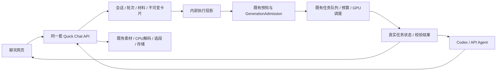

# Quick Chat 本地集成交付

时间：2026-10-05，Australia/Sydney。状态：已完成本地实现与验收，**未发布生产**。体验基准为认可的 `../video-studio-design/quick-chat-mock/IMPLEMENTATION-HANDOFF.zh-CN.md`；不复制mock假回复、假视频、定时进度、内存历史或假Key。

最新补充：本轮已按8865实际页面恢复8870布局与交互，详细对照、后续必要修复和最终验收见 [QUICK-CHAT-UI-RESTORE.zh-CN.md](QUICK-CHAT-UI-RESTORE.zh-CN.md)。文字交接不能替代实际页面基准；下方记录包含前一阶段验证，不代表本轮全部重复执行。

## 现在可以查看

- 本地聊天创作：<http://127.0.0.1:8870/quick-chat>。使用原本地测试账户 `superdan` / `supervan`；用户名登录仅限该loopback隔离预览，不是生产认证。
- Agent公开入口：<http://127.0.0.1:8870/for-agents>，包含机器指南、Skill、helper manifest与只读参考文档。
- canonical源码：`C:/Users/danmo/Desktop/inference/video-studio-design/studio-app/src`。`h3-studio/yingxu` 发布快照未同步，未push/触发CI/CD，原线上网站仍运行原版本。
- 本地数据：`h3-studio/.platform-quick-chat-preview`，复用项目既有SQL/文件存储实现，与生产和旧预览数据隔离。启动：`.venv/Scripts/python.exe -X utf8 tools/run_quick_chat_preview.py`。旧预览/服务保留。

预览明确关闭generation、assistant、render与GPU worker。可以保存会话、图片/视频/音频、文字、卡片版本和预检；真实生成按钮按阻塞原因关闭。任务生命周期在临时测试数据库与假执行器中验收，没有让真实用户队列跑测试，也没有新租GPU或调整原预算/期限。

## 交付范围

| 用户操作 | 页面与统一API | 本地证据 |
|---|---|---|
| 新建、切换、命名创作并继续 | 独立会话目录，持久轮次/材料/下一轮参数，深链接 | 浏览器新建/切换/刷新；账户隔离、分页、版本CAS |
| 拖入图片、视频与音频 | 上传、缩略图或播放、首尾帧/参考/锚点用途、参与开关、原声与片段 | 真实CPU PNG/WAV/MP4上传；多文件顺序收据与刷新恢复 |
| 先选生成方式、再设置参数 | FL/Ref、时间/清晰度/画幅/声音/1–4份与折叠高级控制，来自实际capabilities | 页面内模式切换确认；全能、10秒、两份与预检走查 |
| 讨论、表达修改或直接出卡 | 持久turn，assist/discuss/none；独立手工或Agent卡片入口 | disabled/纯讨论无视频job；结构化建议、卡片/controls继承、输入manifest假HTTP测试 |
| 只改一张卡 | 不可变revision、提示词/独立素材/参数、历史版本、复制新卡 | 浏览器v2去音频，下一轮素材保持；刷新保留两版 |
| 预检后确认抽卡 | 逐份固定uint64种子、整批估算、明确确认、真实item/job/status | 实际API/compiler/AssetService/队列集成；网页与两个PAT重复确认只得一批 |
| 失败时保留成功的份 | 单项cancel、停止证明后的retry；未准入项恢复原job，未知执行不双投 | 部分准入、取消竞争、丢响应、跨actor唯一retry、attempt历史保护 |
| 把结果重新作为参考 | artifact→asset显式导入、hash/类型/收据校验，不自动加入下一轮 | 实际CPU JPEG/WebP导入、固定client_asset_id恢复、选择intent保存 |
| 一次连接Codex，网页接手 | 五分钟一次码、固定授权profile、OS安全PAT、恢复/撤销，公开Skill | 38项连接离线验收；Windows临时DPAPI，真实app权限/来源边界 |

全部控制是否能实际执行，仍以当前执行池和本次预检为准。未声称Base拥有未公开功能、图像/音乐/Marble生成、团队共享或服务端媒体ZIP。copies代表多个独立任务，不是原生模型batch或单个任务多卡并行。

## 从用户操作到后台执行

隐藏project/shot只给执行器使用，普通故事目录不展示；旧project/actions/计划/批次写入口不能绕过聊天revision。API保留实际调用者权限；内部业务actor只用于执行幂等命名，不冒充用户或提升权限。

一张revision只有一批submission，原item/execution重试只有一个后继执行。预检和提交核对 `revision.input_hash`，投影另外核对hash；JS用十进制字符串保存uint64种子。未准入恢复检查真实attempt表、预算reservation、lease和停止证据，不能因为汇总字段为空就重新执行。

Timeline只记录真实创作命令/恢复动作，独立GET原submission读取执行状态；没有定时百分比、GET造事件或假结果。助手180秒以上的陈旧调用由30秒SQL-only核对器恢复，unknown需要用户确认已知边界，不自动重发模型或视频请求。业务备份加入新聊天表，排除连接授权表，恢复后的不明执行与旧预检保持冻结。

## 实际API契约

完整调用顺序与输入格式：`skills/sixnine-yingxu/references/quick-chat.md`，也公开于 `/for-agents/references/quick-chat.md`。所有 `/v1`读写需现有账户Cookie或PAT；兑换端点是精确的匿名例外，仍校验来源。owner/tenant只来自认证。公众helper无需私有AI-Registry。

| 命令 | 实际输入要点 |
|---|---|
| POST `/v1/quick-chat/sessions` | title/model_id可选；返回session/id/version/web_url |
| PATCH `.../sessions/{id}` | expected_version；title/model_id/next_settings可选 |
| POST `.../{id}/assets` | multipart file + 稳定client_asset_id；不要求隐藏project ID |
| GET/PUT `.../{id}/materials` | PUT expected_version + 完整bindings；新binding version=0，旧引用按版本；effective_enabled/inactive_reason另报告当前模式实际参与 |
| POST `.../{id}/turns` | expected_version、text、精确model_id；assistant_mode=assist/discuss/none。none + create_card=true 原子保存本轮与真实草稿卡并返回card_id，不调用助手或排队；旧none无flag仍仅存文字 |
| POST `.../{id}/cards` / `.../cards/{card_id}/revisions` | 完整prompt/recipe_id/controls/inputs/copies；修订另带expected_card_version，可记录source_revision_id/turn_id |
| POST `.../revisions/{rid}/preflights` | capabilities_version、revision_hash=revision.input_hash；单项恢复可带item_ids/retry_of_execution_id |
| POST `.../revisions/{rid}/submissions` | preflight_id、revision_hash、confirmed=true；原逻辑Idempotency-Key |
| GET `.../submissions/{sid}` | 原items/execution/job/artifacts及安全错误；独立于timeline游标轮询 |
| POST `.../submissions/{sid}/items/{iid}/retry` | retry_of_execution_id、fresh_preflight_id、confirmed=true；仅已证明停止的失败项 |
| POST `.../submissions/{sid}/resume-admission` | item_ids、fresh_preflight_id、confirmed=true；保持原任务身份 |
| POST `.../submissions/{sid}/cancel` | item_ids可选；记录取消意愿，不把请求取消当成上游已停止 |
| POST `.../{id}/result-imports` | source_artifact_id、purpose/source_range可选；ready后再明确绑定 |

所有逻辑写入保持稳定Idempotency-Key；超时回放原body/key，409先核对旧收据与版本，不另建付费任务。timeline前后cursor、原asset_id与client_asset_id、连接码ID与正式Key不是同一个身份。

目前业务HTTP主体仍由共享Python服务严格校验，OpenAPI的dict主体不能取代详细字段文档；未完成统一IDL自动生成类型。网站client、公开示例及实际服务通过同一HTTP集成验收，这一限制明确保留为后续工程项。

## 验收结果与边界

- 后台合并回归：332项，326通过、6项跳过；涵盖新聊天/连接、旧API/Auth、上传/请求admission、生成草稿、队列/repository、批次、备份、前端路由、guided/source/audio。跳过项受Windows/POSIX、symlink权限或需显式独立PostgreSQL环境限制。
- 后端最终修正后，49项聊天/adapter/恢复/真实HTTP集成/独立安全审阅再次通过。仅对后续确有修改范围复验。
- 前端最终build成功，独立QuickChat chunk约85.08KB（`QuickChatWorkspace-BfE0fnzG.js`）；17项新关键检查包含于全量Node回归，**289项全部通过**。最后时间锚点组件输入改为本地编辑后blur/Enter保存，避免逐字PUT打断输入；只重build检查语法，没有重复运行未受此组件改动影响的client/model/controller测试；不改变API数据契约。
- 浏览器真实走查使用synthetic本地素材，未传用户生产媒体或调用模型。新会话/三类上传/全能两份/预检/独立卡版本/刷新持久化均已有证据；原生confirm改为页内提示，匿名登录迁移和旧poll版本回滚已修。
- Chrome细节验收：匿名PNG/4秒WAV/prompt→supervan登录保留草稿→明确目标→上传→全能切换页内确认→10秒/2份→v1/两种子预检→v2只去音频、composer保留音频→刷新保留两版→v1 canonical revision深链接恢复原输入和原预检；已发送prompt不会从新创作草稿桶恢复。root另验PNG/WAV/3秒MP4连续上传与刷新。`?card=`/`?revision=`/`?submission=`定位指定资源，而非静默跳到最新版本。
- 截图：`.platform-quick-chat-preview/acceptance/quick-chat-final.jpg`，不含连接码或Key。健康检查status=ok、generation=false、backend=disabled，guide.version=3，新会话入口和公开Quick Chat参考文档HTTP200。
- 真实PostgreSQL竞争、生产公网认证/兑换、准确Google hosted IDs多媒体能力/额度/费用，以及H3/GPU推理未实测；不以测试mock、监听成功、历史模型目录或既有GPU回执替代本批次实测。
- Google精确ID仍 `gemini-3.8-flash` / `gemma-4-31b-it`，中央 `gemini/gemini--user-supplied`；schema分别列implemented/verified/enabled，默认关闭。inline上限是本adapter保护范围，不是上游全部能力。
- Windows公众helper用DPAPI；Linux需可用Secret Service，macOS暂不支持。无安全存储时明确停止，不把Key降级写普通文件。内部 `sixnine/sixnine--inference` 配置保留。

中央独立变更记录：`C:/Users/danmo/Desktop/AI-Registry/inbox/Sixnine-H3Studio-QuickChat-local-20261005T112400Z.md`。没有修改中央正式目录、迁移模型/环境/钱包或创建项目.env。

本批次下一步是用户检查本地体验并确认上线。发布前再执行对应生产配置/精确版本检查与受保护流程；不能直接把隔离预览配置、假值测试或本地认证带到公网。
