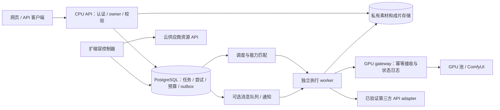

# H3 Studio：多 GPU、自动扩容与 API 分流设计

编写日期：2026-10-04（悉尼）。**本文是待实现、待验收的架构；没有启动 GPU、调用供应商或证明当前具备分布式能力。** 当前 Lightsail 包装仍固定 `H3_GENERATION_ENABLED=0`。GPU 已按用户要求销毁，新增租赁须另有授权。

同日供应商补充核查见 [API-PROVIDER-COMPATIBILITY.zh-CN.md](API-PROVIDER-COMPATIBILITY.zh-CN.md)：Engy 公共 OpenAPI 已确认 `/v2/video_generation` 等路由，但未提供完整请求体；Boyesir 新增逐型号公开能力与报价证据。下文供应商表保留最初设计时的历史依据，以补充核查区分新事实与未知项。仅执行公开只读 GET，没有使用买方凭据、上传或生成，也未实现 adapter。

当前应用采用 SQLite、进程内 worker 与单个 loopback ComfyUI 入口。复制应用容器或增加 Uvicorn worker 不能直接获得安全的多 GPU 调度；会引入重复领取、重启状态冲突和重复计费风险。先让密码账户、网页、上传与历史下载稳定上线，再逐阶段增加生成能力。

## 1. 用户如何选择

| 生成偏好 | 允许执行的后端 | 页面承诺 |
|---|---|---|
| 仅自托管 | 已验证且符合控制要求的自有 GPU 池 | 排队等待，不将素材发送给第三方生成 API |
| 允许 API | 指定的已验证 API，可按用户选项允许自托管 | 显示具体服务商、型号、能力差异和预计费用 |
| 自动选择 | 用户已同意的自托管/API 集合 | 在功能、预算、等待上限内选择；无法满足时停在待处理状态 |

每次提交保存不可变偏好快照：允许的后端/服务商、`max_cost`、`max_wait_seconds`、输出要求、所有输入与控制项、是否允许素材交给第三方。项目默认值可帮助填写，但修改默认值不追溯改变旧任务。`max_wait_seconds` 是允许排队/等待新容量的期限，不承诺届时完成视频。

确认页显示“由谁生成、准确 model ID、自托管 checkpoint revision、估算范围、素材去向”。任务卡显示当前后端、排队原因、生成/下载/核验阶段及费用状态；换后端必须留下尝试记录。用户不必理解 GPU 节点或供应商任务 ID。

## 2. 系统拆分

CPU API 不加载模型，也不在 HTTP 请求内等待生成完成。worker 负责素材传送、提交、查询与下载；GPU gateway 负责单机实际队列、幂等接收和对应运行状态。云创建/销毁权限只授给控制器，不授给浏览器或普通 worker。

素材与输出采用 owner 校验后的对象引用；跨机器不能依赖现有 SQLite 中的 Windows 绝对文件路径。迁移时保留原文件与清单，核验 owner、大小、现有校验值与可解码性，再切换引用。对象存储是设计选项，本次没有创建 bucket、搬家或删除资产。

## 3. 任务账本、领取和恢复

建议核心表：`jobs`（用户请求与状态）、`attempts`（后端尝试）、`worker_leases`、`gpu_instances`、`budget_reservations`、`artifacts`、`outbox`。唯一约束至少覆盖 `(owner, idempotency_key)`、`(job_id, attempt_no)` 和每次提交的 `submission_key`；幂等键相同而请求摘要不同应报冲突。

多个 worker 在短事务内通过 `FOR UPDATE SKIP LOCKED` 领取符合条件的任务，写入 `lease_owner / lease_until / fencing_token` 后提交事务；网络调用不占着数据库事务。后续状态更新必须匹配领取版本。该机制适合队列领取，但不是通用一致性读取：[PostgreSQL SELECT 文档](https://www.postgresql.org/docs/current/sql-select.html#SQL-FOR-UPDATE-SHARE)。

worker 心跳只延长自己的租约；租约过期先进入恢复检查。**租约过期不等于上游任务失败，更不等于可以再提交。** GPU gateway 需要持久记录 `submission_key`，对重复接收返回原任务，拒绝过期 fencing token；重启后通过 ComfyUI 历史和自身日志核对。

任务主线为 `queued → claimed → submitting → running → collecting → succeeded`，另有 `failed / cancel_requested / cancelled / blocked / submission_unknown`。每次供应商提交前先持久写入提交意图；收到 task ID 后立即写账本。超时、断连或进程在提交后崩溃，状态变为 `submission_unknown`，只允许查询/核对，不盲目重投或切换 API。

每个 attempt 只发出一次非幂等创建请求，禁用 SDK/HTTP 层对该 POST 的自动重试。仅当供应商明确支持且已验证幂等键时，才允许携带相同键恢复同一提交；没有状态查询依据时保留不确定状态，由管理员确认。应用侧的提交约束不能宣称供应商内部“恰好执行一次”。

成功以输出落入受控存储并完成媒体核验为准；供应商成功但下载失败只重试下载。晚到的原任务结果按 attempt 归档，不覆盖另一次结果、不悄悄重复结算。取消只有确认上游取消/未提交才释放相应预留；不支持取消的供应商仍可能计费。

第一阶段可直接用 PostgreSQL 领取，不必同时引入 Redis、Celery 和 SQS。若增加消息队列，任务与 outbox 同事务提交，转发器重试投递；消息只唤醒 worker，数据库仍是事实来源。采用 [transactional outbox](https://docs.aws.amazon.com/prescriptive-guidance/latest/cloud-design-patterns/transactional-outbox.html) 防止“数据库已写、通知丢失”；[SQS 标准队列可能重复投递](https://docs.aws.amazon.com/AWSSimpleQueueService/latest/SQSDeveloperGuide/standard-queues-at-least-once-delivery.html)，消费者必须去重。

## 4. 公平排队、预算和容量

按用户轮询或 deficit round robin 分配可执行任务，结合每用户并发与排队上限。长视频按估计 GPU 工作秒数计入公平额度，老任务有等待保护；不能让一个用户连续提交短任务挤掉别人。当前 GPU 先按每卡一个生成槽设计，增加同卡并发须有显存和性能实测。

在同一数据库事务中锁定预算账户、校验可用额并创建预留；以最小货币单位整数记账。每任务最高价、每用户/全局日预算、供应商额度、`max_gpu_count`、运行小时上限共同约束调度。并发调度者不能分别看到同一余额而超卖；GPU 冷启动和空闲费用也必须进入全局预算。

价格、汇率、税费、出网和取消计费口径需带来源与有效期。没有可核实价格/额度的后端保持不可自动选择；历史报价不用于当前自动扣费。预留不等于实际支出，完成后记录实际账单或“待对账”，未知账单不能当零成本。

扩容看“最老可执行任务的等待时间 + 预计积压工作量”，不只看任务个数。按模型、GPU 类别、尺寸、时长、步数、参考组合分别维护耗时估计，保留误差；新配置没有样本时用保守估计并标记。

每轮规划将 `ready / busy / starting / draining / failed` 实例都纳入容量账本；对 starting 记录预计就绪时间，模拟各槽位下一次可用时间。仅当现有和已启动容量仍无法满足允许等待且预算足够时提出新增机器；单个 leader/事务资源意图防止两个控制器同时扩容。

控制器从 dry-run 开始：只记“应增加几台、理由、预算影响”，不调用创建 API。正式开启后设置最大台数、创建超时、扩容冷却和失败退避；供应商创建响应不确定时按资源标签/请求标识核对，不能马上再创建。节点不健康就停止接新任务，但其云账单仍要持续核对。

缩容先将节点标为 draining，停止领取新任务，等运行任务、输出下载和状态核对完成，再销毁并通过供应商列表确认消失。缩容冷却、最低保温数量和无任务保温时间需要成本实测后定值；当前授权状态下最低数量为 0，不自动重租。

H3 历史部署的五份权重总量约 **190GB**；新机器需要下载/挂载缓存、加载模型和健康检查，冷启动不是几秒。缓存按固定 revision 共用或预热镜像/数据盘，保留存储与流量成本；没有模型实际加载成功的机器不计 ready。已销毁实例上的缓存不视为现存资产；本地没有这份完整权重备份。

## 5. 供应商 adapter 与能力匹配

统一接口建议为 `capabilities / estimate / submit / poll / cancel / fetch_result / reconcile`。能力元数据包括准确 model ID、输入模态与数量/总时长、分辨率、视频时长、首尾帧、guides、seed、steps、音频输出、取消、幂等和报价有效期。每项能力有证据来源与验证时间，缺项取“未知”，不可当支持。

| 后端与中央资源 | 已知依据 | 自动分流前缺口 |
|---|---|---|
| 自托管公开 H3-Base；历史 Lium PRO 6000 | 本项目工作流、模型 manifest 和真实输出记录；原生多模态与细粒度控制 | 实例当前已销毁；分布式 gateway、重启恢复和容量实测尚未实现 |
| Boyesir：`boyesir-video-api` / `boyesir-lec-minimax-h3-768p` | service `boyesir`，profile `boyesir--boyesir-windows-dpapi`；准确 model ID **`lec-minimax-h3-768p`**；历史图片参考、4/8/10/12秒请求、1344×768输出 | 当前鉴权、价格、并发、输入上限、视频/音频参考、guides、控制项及真实上游身份未验收 |
| Boyesir：`boyesir-minimax-h3-space-768p` | 准确 ID **`minimax-h3 768p`** 含空格；2026-09-13有“模型已下架”失败记录 | 与 LEC 型号分开；无该通道成功证据，保持不可选 |
| Engy：`provider-engy-api` / `offering-engy-minimax-h3-unverified` | 中央仅有公开报价/文本接口记录，未导入买方 API key | H3 准确 model ID、视频提交/轮询端点、参考能力、限额、价格和账户权限均待核；不能猜用聊天接口 |

Boyesir 历史调用为 `https://boyesir.com/v1/videos/generations`、`GET /v1/tasks/{task_id}`，素材上传 `/api/ai/upload`；这只是历史接口依据，不是本次在线验收。Engy 的历史 H3 报价不证明已具备可用视频 API。

已有 profile 必须通过中央加载器取值；不能把 Windows DPAPI 文件直接搬到 Lightsail Linux 后假定能解密。远端凭据运行机制需中央管理方确认并独立验收，只向专用 adapter 进程提供所需凭据，不进 Git、镜像、普通 JSON、文档或项目 `.env`。

路由先检查用户允许集合，再做全部强制能力匹配，最后比较预算、预计完成时间和健康情况。包含音频参考、动作视频、guide、指定 seed/steps 的任务，在 API 无对应能力证据时只进入自托管候选；不悄悄删除输入或舍弃参数。没有匹配后端就说明具体缺口，并允许用户主动修改请求。

同名“H3”不能承诺是同一 checkpoint 或同一效果。供应商返回的 model 字段也不是权重身份证明。对照评测保存提示词、素材、选项、输出与实际后端，分开比较质量、支持能力、总时延、成功率和总成本；不把其他模型输出标成自托管 H3。

## 6. 分期与可执行验收标准

| 阶段 | 交付 | 必须通过的验收 |
|---|---|---|
| A：CPU 网站 | Lightsail 包装、HTTPS、正式密码认证、CI/CD、数据独立于镜像；GPU 关闭 | superdan/supervan 登录与 owner 隔离；重发部署保留数据库/媒体；GPU-off 时不访问 Comfy、不创建云资源；失败版本可回滚 |
| B：任务账本 | PostgreSQL、独立 worker、私有素材引用、领取租约、attempt 与预算账本 | 多 worker 对同一请求只形成一次提交意图；并发预算预留不超额；相同键不同载荷报冲突；任务/产物不能跨用户读取 |
| C：后端 adapter | 先自托管 gateway，再逐个接入有依据的 API | 假后端覆盖接单后断线、响应丢失、重复回调、租约过期、下载失败、取消失败；不确定提交不重投；不支持的参数在提交前明确拒绝 |
| D：扩容 dry-run | 耗时估计、starting 容量、预算和冷却策略 | 两个控制器竞争不产生重复资源意图；有 starting 实例时不无条件重复扩容；大任务与小任务混合不饿死某用户；没有任何真实创建/销毁调用 |
| E：受控真实验收 | 获授权后小额上线单后端，再两台 GPU 或 API 分流对照 | 预先确认预算/最大台数/停机规则；实际故障恢复无重复收费提交；产物下载核验；所有实例与账单可追溯；能力/性能实测后才启用对应路由 |

并发测试要分开报告“同时在线用户”“请求接收速率”“排队任务数”“实际生成槽位”和“每小时合格视频产量”。初始离线验收可用 100 个用户、1,000 个假任务、4 个 worker 测重复/公平/预算不变量；这不是已跑结果，也不是可承诺的生产容量。真实压测目标须按选定 CPU、数据库、素材流量和实测 GPU 吞吐设定。

上线监控至少包括按用户/后端的队列等待、提交不确定数、实例 ready/starting 数、冷启动耗时、成片失败率、下载待完成数、预算预留与实际支出差额。CPU 站点健康与生成后端健康分开展示；GPU 离线不该让历史作品页下线。

## 7. 依据和未解决事项

本次只读取相关目录、已有文档和官方机制说明。中央快照为 `C:/Users/danmo/Desktop/AI-Registry/registry/resources.json`（记录审阅日2026-10-01），Boyesir 原证据见 `inbox/Seedance-video-voice-20261001T005730Z-98r.md` R006/R007，Engy 见 `inbox/Registry-engy-public-api-check-20261001.md` R001/R002；`reported_working` 仅代表历史。

自托管依据为本项目 `HANDOFF.md`、`README.zh-CN.md`、`CONTROLS.zh-CN.md`、`result-index.json` 与 `gpu-shutdown-receipt.json`。现有 `DEPLOYMENT-OPTIONS.zh-CN.md` 的“现有 Lium GPU 继续运行”是停机前资料；以最新销毁记录和 `H3_GENERATION_ENABLED=0` 为准。

待落实：公网域名/账户与密码恢复方式、数据库/对象存储选型及备份恢复演练、GPU gateway 协议、费用/并发授权值、远端凭据机制、供应商实际能力与配额。本文没有完成这些接入，没有创建 Postgres/队列/对象存储，也没有把候选供应商变成可用资源。
