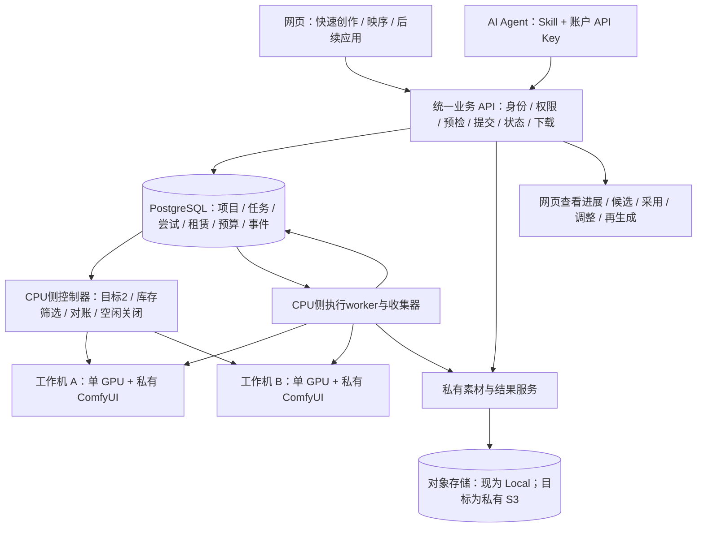

# Sixnine / 映序：按需双 GPU 与统一创作平台设计

设计日期：2026-10-05 14:47 Sydney。来源：用户最新要求、当前项目代码、既有运行回执、AWS 官方设计资料。

状态：**设计完成，双机按需策略尚未实现或上线**。本次没有租赁、改生产配置、迁移存储或扩大预算。公网状态引用 2026-10-05 05:23 的历史回执，不代表本次查询了实时库存、余额或服务器。

## 1. 这次确定的运行方式

用户确认生成后，从 0 台启动到目标 2 台；两台都是独立单卡工作机，每台一个执行槽。先准备好的一台立即处理原任务，第二台继续准备，不需要等到 2/2 才开始。两台领取不同任务，同一任务不重复投两台。空闲时不常驻。

两台在活动期都能接单，一台失败时另一台继续服务。两台都忙时没有额外空闲备用，因此这是增加执行冗余，不保证任何时刻都有空闲卡。一个任务跨两卡的张量并行是另一种部署方式，不包含在本设计内。

| 项目 | 本轮决策 |
| --- | --- |
| 空闲容量 | 0 台 |
| 有已确认生成需求时 | 目标 2 台，最低可服务 1 台，总上限 2 台 |
| 启动触发 | 服务端成功接收的生成任务；浏览、编辑、上传、预检不触发 |
| 初始创建 | 一个事务登记session、A/B成员、两份预算预留及两个唯一意图；提交后分别创建 |
| 第二台不可用 | 已有健康机器继续接单；展示缺货、启动失败或预算原因 |
| 闲置关闭 | 全池没有执行义务后连续 600 秒，关闭两台 |
| 执行与验收 | 环境检查后处理真实队列；成功直接交付，不每台先生成三个测试视频 |
| 账户范围 | 先保持既有 superdan / supervan；新账户开放要经过独立权限和配额验收 |
| 费用边界 | 原累计 GPU US$50，不充值、不重置；原授权截止和供应商 TTL 不延长 |

如果首次启动不能预留两台的完整承诺费用，不偷偷改成单台付费启动；任务显示预算阻塞。已有健康机器、另一台补机预算不足时，保留现有可服务容量并明确显示 1/2。这样的降级不会取消原任务或改变账户。

## 2. 整体架构与产品边界

保持当前模块化业务服务与 PostgreSQL 队列，先不增加 Kubernetes、Redis 或第二套队列。API、worker、控制器使用同一持久任务契约，但职责分开：API 负责接收和授权，worker 负责执行与结果收集，控制器负责机器生命周期。浏览器和 Agent 都不直接访问裸 ComfyUI。

数据库访问、领取、对账和结果入库在 CPU 控制侧执行，GPU 只接收本任务授权的输入并提供受保护 ComfyUI 推理。数据库和云供应商凭据不分发到 GPU；上图的两台机器不要求 GPU 直接访问 PostgreSQL。

底层 H3 API 暴露已支持的分区输入和控制；guided API 将故事、章节、角色、地点、镜头和参考用途转换为同一任务格式。映序与快速创作共享素材、任务、版本和结果，避免各应用分别造一套生成后台。Agent 回写的网站数据与用户编辑同源，仍有版本冲突检查与来源事件。

原生模型能力、当前开放范围、特定机器成功证据必须分开。`MiniMax-H3-Base-BF16` 是执行模型 ID；中央资源 ID、API profile、启动验收 profile 都不能替代 model ID。双机策略不扩大当前控制或输入上限。

## 3. 已有能力与需要补的部分

| 能力 | 证据和状态 |
| --- | --- |
| 公网身份、账户 API Key、任务、项目、下载和 Agent 回写 | 历史线上成功，最新完整回执为后端 `8c35fe7` |
| 两台独立单卡并发 | 旧有限测试有两台 PRO 6000 成功记录；不是当前按需控制器已支持双机 |
| 持久队列、租赁意图、预算、未知提交保护 | 已有实现，需保留 |
| 用首个真实任务验证新 GPU | `queued-task-first-v1` 本地实现，46 项新离线检查通过；尚未切换公网 |
| 每次需求自动启动两台 | 本设计新增，尚未实现 |
| 单机失败时另一台继续工作 | 需要修正全池暂停逻辑；不能凭两台实例存在声称完成 |
| 原失败任务安全跨机重试 | 需要新增明确的 retry transition；当前不会自动重投 |
| 素材脱离 CPU 主机磁盘 | 目标私有 S3；当前仍为 Local 存储 |
| 模型持久缓存与预装镜像 | 需要独立实现与实测；旧临时 pod 缓存不是持久缓存 |
| CPU / 数据库高可用 | 当前单主机，无本次完成证据 |
| Engy / Boyesir 作为 H3 自动兜底 | 本次没有协议、完整参数和生成成功验证，不启用静默转发 |

当前单 CPU 主机承载 API、PostgreSQL 与 Local 素材；双 GPU 无法消除这一故障点。恢复与冗余要覆盖各层，而不只增加执行节点。[AWS Reliability Pillar](https://docs.aws.amazon.com/wellarchitected/latest/reliability-pillar/welcome.html)

## 4. 双机生命周期与持久数据

当前 `OnDemandConfig` 强制单实例、单物理 GPU；`_managed` 只认一个意图；`capacity_cycles` 的一个 approval 绑定一个 bootstrap intent。不能仅把 `max_instances` 改成 2，否则第二台会被当作异常实例。

新增显式双机 policy，并保留旧单机周期的解释方式。建议 policy 名 `paired-demand-v1`，这是设计名，尚未登记为可用配置。它与启动 profile `queued-task-first-v1` 是两个不同维度。

| 数据 | 作用与约束 |
| --- | --- |
| 既有 job / attempt | 用户任务保持原 ID；每次实际尝试独立记录，绑定工作机、请求快照和上游任务 |
| 既有资产 / 预算 / 租赁意图 | owner 校验、不可变结果、计费预留、供应商对账继续复用 |
| 新 gpu session | 一个活动期的需求、父审批、原预算、原截止、目标容量及全池 idle 时间 |
| 新 session member | A/B 槽位，各自的 intent、实例、报价、TTL、worker、检查结果和销毁事实 |
| 新 retry transition | 原任务新的有限尝试；停止证据、旧 worker fence、费用和失败分类必须可审计 |

用数据库唯一约束限制活动 session 和 A/B 成员，用事务锁与 controller fencing 防止两个控制器同时扩容。首次启动在一个事务内持久化 session、A/B 成员、两个 pending intent 和对应两份 reservation，提交后才分别 POST；复用现有逐 intent 预留时，不再另扣一份父预留。重启只恢复这些既有身份，不重新创建一对。

成员确定没有发出 POST 且被取消、缺货或过期，可以经事务释放其预留；出现 POST-started 或创建结果未知就保留意图、成员配额和费用预留，直到权威供应商对账。取消 API 请求不能直接释放创建未知的费用。创建结果未知的成员同样占用总上限；不能用“列表为空”解除它。

审批接收与激活必须基于 session 内任一匹配且健康的成员，不再依赖旧主 bootstrap intent。当前 `capacity.py` 中主意图 draining / destroyed 会使整个 approval unavailable，这条逻辑也要改；否则 A 失效后 B 虽然健康，新任务仍会被挡住。未知 B 占用费用和成员配额，但不禁止健康 A 服务其他任务。

成员状态独立：`requested → creation_unknown / booting → runtime_checked → ready → draining → destroyed → settled`；`quarantined` 表示暂停新领取，原运行任务仍需对账或收集。租赁、工作机、任务是不同状态，不能把 worker 失联直接解释为实例销毁。

`runtime_checked` 允许执行受限真实任务，`generation_verified=false`。只有该实例的真实结果校验成功，才能记录具体 recipe、输入类型及参数范围；A 的成功不能代替 B 的验证。没有第二条任务时 B 不额外制造验证视频。

## 5. 接收、调度、关闭的完整流程

1. API 校验身份、参考素材、控制范围和预算。成功接收后返回同一 job ID；幂等重试不得重复建单。阻塞或失败不能显示为成功。
2. 控制器在持久锁内确认存在真实需求和有效授权，核对本任务全部活动及未知租赁，在同一事务登记 session、两个成员意图及最大承诺费用预留。
3. 按条件筛选兼容 GPU / 显存 / 位置 / 价格 / 容量 / 镜像，优先不同宿主机；不锁固定机器 ID。同一供应商仍有共同故障风险，供应商未提供故障域信息时不声称跨故障域冗余。
4. A/B 各自先登记意图后创建；运行阶段可独立准备。供应商一次创建不明时仅对账该成员，另一个已授权成员可继续，不创建第三台。
5. 每台做固定源码、模型文件、显存、runtime、上游空闲状态检查。第一台就绪即领取原任务，不等待另一台，也不预跑合成视频。
6. PostgreSQL 事务独占领取，按既有账户公平性分配不同任务；每台只允许一个有效执行槽。上游提交前持久记录，提交不明保留原绑定。
7. 推理结束进入收集，校验可解码输出与哈希，私有存储落盘后才完成任务。结果通过同一 job / artifact 返回网页和 Agent，可作为候选采用或重新编辑。
8. 全池排队、执行、原输出收集、取消对账及提交未知等执行义务结束，连续 600 秒进入 drain。权威证明上游已停止且结果已持久化后，仅最终账单未结算不阻止销毁，费用预留保留至独立结算，避免等账单才关机的循环。草稿或未确认计划不保持 GPU；一台忙、另一台闲时不单独因空闲关闭另一台。
9. drain 与新任务接收通过同一持久容量锁协调。关闭已开始时，新任务保留排队；不能把正在销毁的机器重新标记 ready，也不取消已接收任务。原 TTL 和授权期限的既有收尾规则优先，不获得新的延期权限。
10. 逐台销毁并通过精确供应商事实核验，单独结算租赁账本。未知销毁保留预留并继续对账；HTTP 请求成功或短暂空列表不等于已结清。

空闲 600 秒从业务义务清空开始，不只是“距上一次新任务进入十分钟”。任务仍在推理时绝不因没有新提交而误关。TTL 到期不是 idle，必须反馈未交付原因并保留可恢复记录。

## 6. 故障处理与原任务保护

目前首任务失败会使整个有限池 drain，新本地策略也会保留全池 backlog 等修复。双机需要改成 **member / worker 局部隔离**，业务审批不随单成员失败一起撤销；健康成员继续领取其他尚未提交的任务。

| 情况 | 行为 |
| --- | --- |
| B 缺货、下载失败或检查不通过 | A 正常接单；B 独立有原因、有退避重查，受原预算与截止限制 |
| A 明确推理失败 | 隔离 A；B 接其他任务；原任务保持错误和 attempt，按下面重试条件决定 |
| 输入损坏 / 参数不支持 / 同配置必然 OOM | 明确用户可调整的原因；不能无意义地在 B 重跑相同输入 |
| 已生成，下载或存储失败 | 优先重试收集原输出，不重新生成 |
| POST 接受后响应丢失 / 心跳丢失 | 保持 `submission_unknown` / 恢复等待，查原 attempt；不投 B 竞速、不盲目释放槽位 |
| CPU / DB 不可用 | 停止新租赁和新提交；恢复后从持久记录对账，远端 TTL 仍限制租赁 |

原失败任务跨机重试只能使用专门的事务转换：有权威证据证明原上游已停止或根本未提交；原 worker 已 fence；失败属于可恢复类型；原尝试费用已可核对；重试预算、原期限和输入仍有效。保持原 job ID，新建 attempt，建议最多一次自动跨机重试，并记录决策。供应商停机证据和计费状态需要逐项满足，不能只靠本地 failed 标记。

现有 `queue.py` 会对已出现 `submission_started_at` 或上游 ID 的历史尝试进入恢复等待。这条保护先保留，新 retry transition 通过验收前不把 failed / unknown 直接改回 queued。旧 attempt 迟到成功不能覆盖新的有效结果。

替换 A 前，确认 A 原租赁销毁及费用事实，才释放成员配额。A 仍未知时 B 可做其他工作，但没有第三台租赁额度。自动补机和任务重试是不同动作，两者各自受预算和身份保护。

## 7. 网页和 Agent 应看到什么

状态由后端事实产生，网页与 API 共用；不能只显示笼统的“等待计算容量”。下表是目标契约，字段名尚未正式发布。

| 展示 | 后端应提供的事实 |
| --- | --- |
| 正在准备 GPU，0/2 | 各成员阶段、开始时间、安全等待原因 |
| 可用 1/2，另一台准备中 | 第一台可接单，第二台启动阶段 |
| 可用 1/2，冗余暂不可用 | 缺货 / 预算 / 引导失败、下次重查时间 |
| 等待容量，原任务已保留 | job ID、等待原因、可取消性；无需重新提交 |
| 正在核对原任务，未重复生成 | 原 attempt 未知，禁止重投 |
| 生成中 / 正在保存结果 / 已完成 | 实际阶段和可访问 artifact，不用虚假百分比 |

建议扩展任务状态附带 `capacity.target / ready / preparing`、`wait_reason`、`stage_started_at`、`retry_after`，并采用向后兼容方式。不存在的字段不写入已上线 API 文档。日志只保留安全代码和非秘密身份，不包含提示词、媒体内容、密钥或签名访问链接。

网站任务状态反馈应在服务内完成，Codex 的本地定时跟进不是生产恢复机制。当前 `gpu` 自动化仍暂停；本设计没有恢复它，也不承诺服务器能即时推送消息到本聊天。

## 8. 素材、成片、模型与环境分开存

**目标选择：项目元数据在 PostgreSQL，用户素材和成片在私有 S3，GPU 磁盘仅放临时输入、输出与可重建模型缓存。** 现有生产 Local 不在本次迁移。当前 release S3 bucket 仅用于发布包，不能把它写成用户素材已经上 S3。

当前路径：`/srv/sixnine/platform-data`（容器 `/data`）、`/srv/sixnine/postgres`、`/srv/sixnine/upload-spool`，都在同一 CPU 主机。对象替换必须先验证当前 AssetService 的条件创建、journal 恢复、multipart、Range、哈希、owner 权限和删除引用契约，再迁移。迁移后校验与恢复测试完成前保留原副本。

素材与结果建议采用不可变对象键，数据库保存 owner、项目、版本、asset ID、哈希、格式和长度。下载先由业务 API 授权，再提供最小范围短期读取；不把整库永久凭据交给 GPU。新 bucket 明确设置静态加密与 TLS、Block Public Access、bucket-owner-enforced 和最小权限角色；AWS 服务主体的策略加适用的 `SourceArn / SourceAccount` 限制，网络入口限制到实际需要的来源。日志目标同样加密，CloudWatch / CloudTrail 使用 KMS；访问日志 bucket 使用服务端加密。[S3 安全最佳实践](https://docs.aws.amazon.com/AmazonS3/latest/userguide/security-best-practices.html)

启用对象版本用于误删恢复，但版本存储与请求也有费用；保留与删除生命周期须独立确定，不能把“可重建”当作删除授权。[S3 Versioning](https://docs.aws.amazon.com/AmazonS3/latest/userguide/Versioning.html)

R2 可以后续通过同一 storage adapter 比较真实传输费用；Hippius 保留实验地位。条件写入、恢复与私有访问未验收前不作为唯一用户资产存储。本阶段不为了加供应商增加两套资产真相。

模型缓存按来源、revision、规格和 manifest 校验，和用户作品分开。现有五个 pinned 权重约 190 GB（177 GiB），两台完全冷机下载约两份，不能预期下载永远很快。旧 pod `/root/hf-cache` 未证实保留；也不能把 AWS EBS 当成可以直接挂到 Lium 的卷。EC2 instance store 的停止/终止会丢失数据，持久数据应另有存储。[EC2 临时磁盘生命周期](https://docs.aws.amazon.com/AWSEC2/latest/UserGuide/instance-store-lifetime.html)

优先准备固定 ComfyUI / 依赖镜像、共享可读取的版本化权重来源、供应商真正支持的持久卷或暖缓存。保留 ComfyUI revision `e9027f2b30f37bb3052714eb08fcf479542f4fc0` 与 Hub revision `e5eb578a89295337b8ff433a035929ce0279e0b6`；替换来源前核对许可、内容与原 manifest，不重复下载已有可复用资产。不把不同项目全部合成一个 Python 环境。

## 9. 费用、启动速度与后续扩容

费用账本以累计已结算费用 + 未结算租赁最大预留为准，不能只看当前每小时价格。按历史配置上限 US$1.50/小时/台、3 小时 TTL 计算，一对保守预留为 `2 × 1.50 × 3 = US$9`，并非当前实时报价或必然账单。

当前 Lium 适配存在 `allow_preflight_only_price_cap`：创建前查价不是供应商原子价格保证。US$9 是预算承诺口径，US$50 是本项目累计授权及准入上限，不能据此承诺供应商绝不会产生超差账单。上线前核对供应商可固定的报价/TTL约束，每次实际租赁回执检查价格；偏离立即禁止新租赁并对账、按安全终止流程处理。无法取得授权额度内可约束的费用承诺时不发送新创建 POST，不自动扩大预算承担差价。

05:23 历史已用 US$5.741432、剩余 US$44.258568；本次没有重查。不能沿用旧“最多八个单机周期”启动八对，因为八对预留 US$72。使用原累计账本动态准入；即便四对预留 US$36 在这份历史快照内，也不构成未来四次租赁已批准。原截止仍为 **2026-10-05 18:45 Sydney**，不会因设计成双机延期。

如果两台价格相同，活动期小时费用约为单台两倍；若只比较两台都空闲的最后十分钟，按该历史价格上限是 `2 × 1.50 × 10/60 = US$0.50`。实际还包括下载、启动、推理和结算时间。其他 CPU、S3、传输和日志费用需按部署地区与实际用量独立估算，未查价不声称满足每月 US$50。

历史约 48 分钟冷启动中，三轮兼容生成占约 39.5 分钟；另约 8.7 分钟是启动准备等时间。去掉三轮生成有明确优化空间，但真实首单还需要下载、模型首次加载、推理和保存；本地新策略尚无新在线计时。双机可能争同一下载带宽，因此不保证首单等待减半。

记录每个阶段的耗时：库存等待、实例创建、环境、权重下载、首次加载、去噪、VAE 解码、收集和保存。先解决下载与环境重复开销，再按实际队列预计 GPU 工作秒数规划容量；不能只凭任务数量，因为 4 步与 50 步成本差别大。

未来大流量才增加 `target > 2`：以兼容任务的积压工作量、可用槽位、预计等待、冷启动和预算为输入，设明确总上限与缩容稳定时间。5090、H100、PRO 6000、B200 各有独立执行能力与速度证据，任务只分到匹配的池；不能因库存可租就自动把未验证 GPU 写成全功能可用。当前这批 max=2。

## 10. CPU 与数据库恢复边界

初期保持现有主机，先补持久恢复与已验证备份，不把 GPU 冗余包装成整个网站高可用。至少验证 CPU 重启后任务、预算、租赁意图、结果引用恢复；备份能实际还原，而不是只找到文件。

后续如要求主机故障时网站仍可用，再规划两台无状态 API、负载均衡、独立持久数据库与 controller leader election；数据库可评估 RDS Multi-AZ。须先核实成本、恢复目标及部署授权，不在本轮直接加设施。对象上 S3 也不能单独解决项目元数据丢失。

## 11. 验收场景

| 场景 | 必须满足 |
| --- | --- |
| 单个真实任务 | 恰好两个独立意图；先就绪立即执行；原任务一次生成、一套结果；另一台不制造额外测试任务 |
| 两账户并发 | PG 领取不重复；两台真实推理时间重叠；输入、结果、取消、下载均按 owner 隔离 |
| 并发触发与重启 | 不变成四台；持久 fence / 唯一约束有效；creation_unknown 占用预算和成员配额 |
| 成对登记后的崩溃 | 登记后未POST、只创建A、A响应丢失/B未POST三种重启都恢复原意图；无无身份或重复预留 |
| 第二台缺货 | 可用机器继续执行；网页有明确原因及重查时间；不绑定固定机器 ID |
| A 已知失败 | 只隔离 A；B 服务其他未提交任务；原任务只通过有停止/预算证据的独立重试转换 |
| 主成员失效后新提交 | B健康时新job可接收、激活和执行；旧主意图不可用不牵连session，未知成员不锁健康成员 |
| POST 已接受但响应丢失 | 重启前后同一尝试最多一次 POST；B 不重投；找到原结果后正常恢复交付 |
| 收集或存储失败 | 不重复推理；不能提前 succeeded；恢复后结果哈希、解码、权限校验通过 |
| 一台忙一台闲 | 全池不误关；新任务与 drain 竞争保留原 job 与预算，不投销毁中的实例 |
| 全池空闲十分钟 | 两台逐一销毁，供应商精确事实与计费账本一致；TTL/期限独立受控 |
| 仅账单等待 | 已停止且结果已持久化后可按idle关闭；预留仍持有，关机不伪称费用结清 |
| 预算不足或 DB 失联 | 无越界租赁、无无账本 POST；已有任务有明确状态；不自动充值或延长 |

先用离线供应商故障注入和 PostgreSQL 并发验证，批次完成后合并必要回归，再做一次有限真实双机验收。真实测试以用户队列可安全执行的原任务优先；没有需求不为证明 B 可用复制 A 的任务。记录真实重叠执行与最终销毁回执，不用 FakeProvider 代替在线证据。

## 12. 实施顺序与发布

1. 新双机 session/member 账本和显式 policy；意图与预算原子登记、两台上限、按健康成员审批、独立创建/对账、旧单机兼容。
2. per-worker 隔离与健康成员继续接单；共享全池 idle、drain 竞争保护、成员销毁及结算。
3. 容量状态反馈与真实首任务启动策略一起接入；不扩大 H3 当前开放范围。
4. 加入受限跨机 retry transition，先完成未知提交、停止证据、迟到结果与预算验收；没有验收前不自动重投。
5. 独立优化预装镜像和持久模型缓存；素材 S3 迁移另批验收，保留旧资产副本。
6. 按最终范围合并测试与一次后端发布，保留确切回执。映序新媒体界面仍按用户要求本地确认后再上线。

旧单机到双机切换必须另有经验证的交接：已开始提交的 attempt 留在原实例、原审批和原策略下对账；仅锁内证明确实从未提交的任务，才通过显式兼容转换转交新 session。保留 job ID、请求、幂等键、费用历史和原期限，不能原地修改活动 approval / policy hash / qualification evidence，或改 execution_plan 绕过 `transfer_unsubmitted_capacity` 的身份保护。

这份设计已经针对上述失败场景审查；实现阶段仍须用代码与真实回执验收。不会通过继续增加文档替代 GPU 链路修复，也不会在设计本身触发云资源。

## 13. 直接相关证据

- 单机限制与意图绑定：`studio_platform/on_demand_scaler.py`、`studio_platform/capacity.py`、`studio_platform/repository.py`。
- 有限双机基础与全池失败隔离缺口：`studio_platform/production_scaler.py`；需求计算 `studio_platform/autoscale.py`。
- 队列与 unknown 保护：`studio_platform/queue.py`、`studio_platform/worker.py`、`studio_platform/scaler.py`。
- 本地真实任务启动策略：`QUEUED-TASK-START.zh-CN.md`、`studio_platform/queued_task_runner.py` 及四个 `test_platform_queued_*` 模块。
- 历史生产证据：`.platform-demand-live/OVERNIGHT-FIX-20261005.zh-CN.md`、`GPU-RECOVERY-HANDOFF.md`；本文件不更新其线上状态。
- 前端 canonical：`C:/Users/danmo/Desktop/inference/video-studio-design/studio-app`；`h3-studio/yingxu` 为发布快照，不直接编辑。
