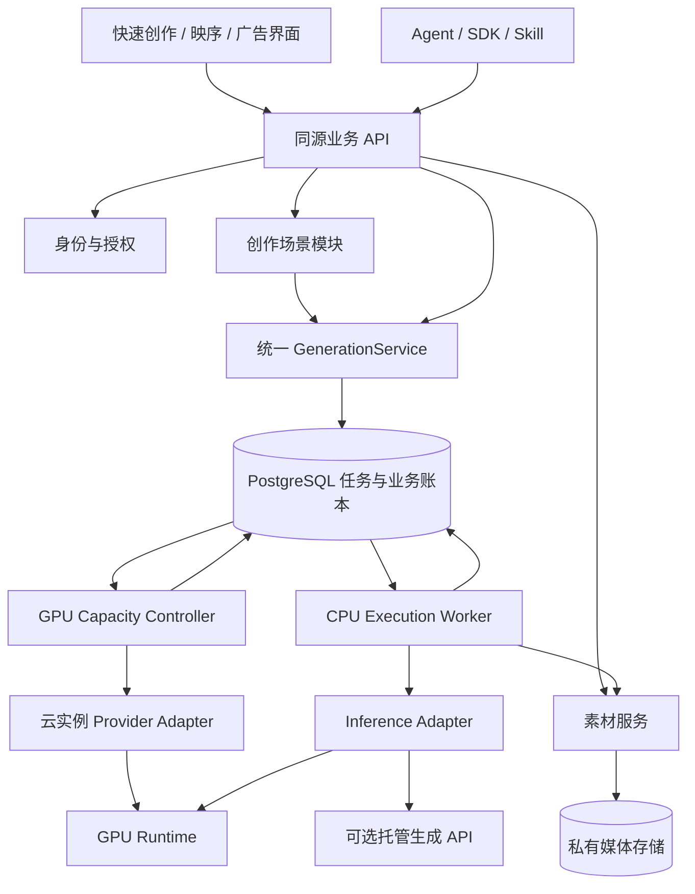

# Sixnine 统一业务 API、生成后端与部署规划

版本：0.2｜初始研究：2026-10-06；路线修订：2026-10-07（Australia/Sydney）

**交付性质：可供讨论、拆任务和开发验收的完整设计建议；不是已上线声明。** 本轮未修改运行代码、安装软件、下载模型、调用付费 API、租用 GPU 或发布。文内路线、目标和接口增量，均需按后面的阶段实施并用证据验收。

阅读顺序：先读第 1–4 节决定架构；第 5–11 节供后端和 Agent 接口开发；第 12–17 节供推理、GPU、部署开发；第 18–22 节用于安排工作和验收。

本文件是中文详细设计，补充英文 [PROJECT-PLAN.md](PROJECT-PLAN.md)，并整合早期 `GENERATION-RELIABILITY-ARCHITECTURE.zh-CN.md`。当前兼容约束读 [GENERATION-CONTRACT.md](GENERATION-CONTRACT.md)，带日期的运行事实读 [CURRENT-BASELINE.md](CURRENT-BASELINE.md) 与后续发布回执；不另维护一套任务状态。已确认的快速创作 UI 以项目 AGENTS 指向的 mock 为准。用户决定发生变化时修订对应段落，不让旧候选排序或新增设计文字覆盖已确认路线。

导航见 [规划与实现索引](PLANNING-INDEX.zh-CN.md)。如何复用现有代码、哪些局部替换、哪些只作退役候选，见 [复用与模块化决策](REUSE-AND-MIGRATION-DECISION.zh-CN.md)；它补充本文的迁移方法，不另建路线图。

## 1. 推荐方案与必须先解决的事

推荐：**Python/FastAPI 模块化业务后端 + PostgreSQL 持久任务账本 + 独立 CPU 执行 Worker + 独立 GPU 容量控制器 + 可替换的推理引擎 + 私有媒体存储。**

近期保留已有 EC2 CPU 控制面和 Lium GPU 通道；存储先保护现有 Local 数据，再评估迁移到私有 S3。**用户已确认采用上游 WanGP headless runtime，通过薄适配器接入，并确认已获得授权。** 固定研究源码为 `deepbeepmeep/Wan2GP@0e58385fbde7ff102d276e4a9e490845de76b4ea`；组件权重、依赖和镜像仍须独立冻结。ComfyUI 保留已有任务的执行/恢复与回滚基线；通过参数、真实推理和恢复验收后，只切新接收任务。SGLang、vLLM-Omni、Diffusers 的内容保留为历史备选研究，不再是当前实施优先级。[R17]

最先完成四件事：

1. 能从公网 API 独立完成上传、确认生成、按需开机、推理、保存和下载。
2. 所有已接收任务有持久身份，重启、断线、取消和结果收集失败都有确定处理方式。
3. 接单条件、引擎控制范围、实例启动配置来自同一个版本化执行配置。
4. 用户与 Agent 能查到真实阶段、阻塞原因和下一步，而不是只有 running 或长时间无解释等待。

网站交互可以独立迭代。生成底座的验收不依赖新版映序页面完成，也不以换框架、换引擎或 GPU 显示 RUNNING 为通过标准。

### 1.1 初始研究纠正的部署认识（历史比较，不改变当前选型）

2026-10-06 初始查阅的 MiniMax 官方资料列出了 SGLang、vLLM、Diffusers、ComfyUI，并给出 SGLang 部署 H3-Base 示例。这些是上游支持证据，不是本站选型或实测。自建全套开放组件是 H3-Base 的两个任务分区及编码器、视频/音频 VAE；完整系统的 Context-IR 与 Regenerate-2K 不能因为部署了 Base 就宣称已经具备。[R1]

初始查阅的 SGLang Ref2VA 文档允许参考素材与首尾 keyframe 组合；这说明不能把旧页面的模板限制永久写成模型规则，但不能转用为 WanGP 已支持/已开放的证据。所选 WanGP 配方的首尾、参考、guide、mask 和高级参数，仍须按其固定源码与实际路径逐项核验。[R2][R17]

“满血”在本项目定义为：**对所选公开模型/配方，不静默丢弃已经承诺的控制与输入；每个限制可解释。** 它不代表同时拥有所有托管功能，也不代表用蒸馏、量化或小编码器后仍与原始配方等价。

## 2. 当前基线：哪些已有，哪些没有证明

| 范围 | 代码/文档事实 | 本轮可据此得出的结论 |
|---|---|---|
| 业务 API | FastAPI、项目、素材、计划、jobs、batches、artifacts、身份和 API Key 已有 | 复用并收敛，不重造三套业务后台 |
| 用户目录 | `auth.py` 仍固定 superdan/supervan；Principal/PAT/owner隔离已有 | 保留授权机制；开放注册或更多账户须先改用户目录及旧owner映射 |
| Quick Chat | Session / Turn / MaterialBinding / CardRevision / Submission 已本地集成 | 本地集成不等于生产发布或真实 GPU 验收 |
| 执行入口 | `GenerationAdmission` 已被故事与 Quick Chat 复用 | 将其稳定为统一 GenerationService 边界 |
| 任务恢复 | SQL 队列、lease/fence、提交未知对账、结果收集恢复已有 | 优先联调与验证真实故障，不把已有机制当新增功能 |
| GPU 执行 | CPU WorkerRunner 调远端私有 ComfyUI；旧策略有真实生成记录 | 这是对照基线；GPU 本身不直接访问业务数据库 |
| 最近新策略 | 10/5 发布了 queued-task-first；新冷启动/15 秒仍缺实测 | 不用旧测试证明新组合已可靠 |
| 服务可用性 | A1 已集中记录带日期的线上观察与未结算义务 | 查 CURRENT-BASELINE 与后续回执；不在本表另维护开关/实例数字，不从旧窗口推断今天可用性 |
| 双机 | 已有设计、旧有限并发实测；当前按需代码仍有单机约束 | 双机按需与节点故障隔离仍需实施 |
| 存储/协作 | 当前 Local 媒体；owner 隔离及版本冲突已有 | S3 迁移、跨账户协作尚不能称已完成 |
| 新引擎 | 已选 WanGP；B2 提供执行接口提取，D1为离线适配器/回执切片 | 尚未证明真实 WanGP 生成、全部控制或生产路由；历史备选不是并行实施任务 |

证据入口见第 22 节。本轮未读取在线队列、账户余额或生产媒体。

## 3. 产品场景与统一 API 的含义

统一 API 是共享身份、素材、生成合同、任务、结果和权限；不要求每个前端长一样，也不要求把所有业务塞入一个 `/generate`。

| 场景 | 用户真正完成的工作 | 场景层保留的业务 | 共用基础能力 |
|---|---|---|---|
| 快速创作 | 上传素材、描述、得到草稿卡、确认抽卡、继续修改 | 对话、轮次、继承材料、卡片版本 | 素材、能力查询、预检、任务、输出 |
| 映序短剧 | 建多个故事、章节、角色和地点、设计镜头、选片、剪辑 | 故事结构、剧本、分镜、角色/地点版本、采用关系 | 同上，加导出/粗剪服务 |
| 广告短片 | 产品/品牌资料、多个创意版本、不同画幅 | brief、品牌约束、方案和版本 | 同一生成、素材和结果服务 |
| Agent 直接调用 H3 | 提交精确素材和参数、取结果 | 可选独立创作容器，不强迫构造章节 | 同一身份/计划/任务/下载合同 |
| Agent 辅助映序 | 创建或修改故事、上传自己的素材/结果、用户网页接手 | 版本检查、actor 记录、来源和采用 | 同一场景命令及资产服务 |

人物造型图、音乐、世界模型/Marble 不是本次 H3 视频部署自然附带的能力。其资源类型和引用可预留，模型服务分别注册、验收后开放；不设置会假成功的按钮。上传外部视频可直接作为素材保存，但其来源是 external，不能冒充本站 H3 生成结果。

## 4. 系统边界与依赖方向



| 边界 | 拥有的决定 | 明确不拥有 |
|---|---|---|
| HTTP/SDK 层 | 协议、类型、认证、请求追踪 | GPU 选择、工作流节点拼装、业务授权旁路 |
| 创作场景模块 | 对话或故事数据、修改意图、生成来源快照 | 另一份队列、另一套扣费、直接访问裸 GPU |
| GenerationService | 参数归一化、权限、预检、接单、业务幂等、批次 | 具体 Comfy node ID、供应商租机请求 |
| Repository/Queue | 持久任务状态、租约、并发约束、预算事务 | 进程内临时任务当唯一事实 |
| Execution Worker | 唯一领取、提交/对账/取消、收集和验证成片 | 租机、提高预算、改变用户需求 |
| Inference Adapter | 将规范请求转换成特定引擎协议；返回规范状态/输出 | 多租户权限、用户计费、场景文稿 |
| Capacity Controller | 条件选机、创建意图、bootstrap、健康、排空、销毁、租赁对账 | prompt、故事、生成结果的业务成功判定 |
| AssetService | 私有上传、校验、衍生、内容访问、完整性与恢复 | 用用户提供的任意本地路径或 URL 代替授权资产 |

代码先保持一个仓库、一套业务服务；API、Worker、Controller、CPU 媒体处理是可独立运行的进程。进程分离不自动实现秘密隔离或高可用。任务语义和接口先清楚，再按需要抽取代码，不进行一次全后端大搬家。

### 4.1 按什么边界改现有代码

| 现有入口 | 收敛后的责任 | 抽取时的约束 |
|---|---|---|
| `studio_platform/api.py`、`quick_chat_routes.py` | 薄 HTTP 路由与兼容序列化 | 不在路由中拼 GPU 命令；保持旧入口可用 |
| `generation_admission.py` | 统一接单应用服务 | 故事、聊天、直接 API 共享同一准入/预算/业务唯一性 |
| `quick_chat.py`、`guided.py` | 各场景的创作命令 | 保存场景状态后通过接单服务执行，不私建队列 |
| `repository.py`、`queue.py` | 持久事实与事务/领取 | 逐域提取查询；不会因拆文件丢失同一数据库事务 |
| `worker.py`、`drain_safe_runner.py`、`queued_task_runner.py` | 执行、排空时恢复/收集、真实任务证据与失败隔离 | 通过 adapter 调用引擎；保留各层保护，不持有租机管理职责 |
| `control.py`、`fleet.py`、`production_scaler_boot.py` | 物理执行槽归属、进程监督、运行时引导 | 不等同供应商租赁；引擎相关准备通过明确接口处理 |
| `on_demand_scaler.py`、`production_scaler.py`、`scaler.py`、`autoscale.py` | 按需周期、有限政策、租赁协调、纯容量建议 | 它们多数在同一调用链；拆开政策并保留唯一租赁副作用权威，不能按文件名删除父类 |
| `production_worker.py` | 历史已交接单卡的有限验收入口 | 部署helper仍有引用；只列退役候选，不当作通用Worker重新扩写 |
| `studio_platform/inference/` | B2已有Comfy适配与共享协议；拟增WanGP薄适配 | 共享错误/回执合同；不在公开DTO暴露私有节点或把新增类视为生产已启用 |

先为上述边界建立可独立调用的接口，再逐步移动实现。不是把一个巨型文件平均切成几份，也不是强制每个模块独立部署。HTTP 层、领域命令、数据访问和供应商协议各自变化时，应能只验相关合同。

## 5. 核心数据：每种事实只有一个权威来源

| 实体 | 权威与关系 | 设计约束 |
|---|---|---|
| Principal | 已有 owner + actor + scopes + 项目范围 | 从认证取得，不信任请求中的 owner；用户与其 Agent 可不同 actor |
| Project / Story | 现有版本化项目文稿；chapter/scene/shot/character/location 等实体 | 一位用户可有多个故事；先保留现有 JSON 文稿与 expected_version |
| CreationSession | Quick Chat 独立会话 | 不同会话不自动继承素材；同会话下一轮的有效材料明确可见 |
| Turn / CardRevision | 轮次与不可变生成草稿快照 | 修改已有卡创建新 revision；生成历史不随草稿修改 |
| Asset | 原件及衍生件的稳定 ID、归属、哈希、实际媒体元数据 | 原件、裁剪模型副本、缩略图各自可追踪；不是只有文件 URL |
| MaterialBinding | 在某轮/某卡/某镜头中如何使用 Asset | role、片段、启用与来源；删绑定不删文件 |
| GenerationSpec | 规范化且不可变的生成请求值对象 | 来自卡片或镜头版本；不另复制成可独立编辑的文稿 |
| Plan / Preflight | 服务端解析后的有效请求、能力版本、阻塞项和费用预留策略 | 有效期只代表提交窗口，不承诺 GPU 实时库存；不在预检时租机 |
| Submission / Batch / Item | 用户的一次明确生成决定及各份结果 | 业务唯一性；每项独立 job/seed，允许部分成功 |
| Job / Attempt | 一次执行义务与每次上游尝试 | 网络重放/收集恢复保留 job；用户显式重试按已有规则产生新 execution/job，稳定的是 submission/item；保留历史和成本 |
| Artifact | 某 attempt 已校验且持久化的输出 | 不可变；采用到镜头或再次作为参考都是显式动作 |
| WorkerSlot / LeaseIntent | 物理容量、部署配置、实例及费用事实 | 与用户 job 分开；lease unknown 不等于 worker 空闲 |

Quick Chat 现有隐藏 project/shot 是兼容执行投影，继续由服务维护；它不能成为第二个可编辑创作源。未来统一执行输入使用 `source_ref={kind,id,revision,hash}`，逐步解除执行层对 shot 的必填依赖。迁移时旧 job/plan/source 身份保持不变。

先不拆完所有故事 JSON 或引入 CRDT。出现真实跨账户协作需求时，增加 project membership、角色、邀请、撤销和审计；再根据冲突数据决定是否细分到 entity revision。账户隔离和同账户 Agent 并发不等于团队协作已完成。

## 6. API 目录：保留真实入口，增量补齐合同

以下“已有”表示本地代码或文档中存在，不表示当前公网可用。Quick Chat及一次性连接码相关接口是本地未发布集成；不能把这张目录当公网SDK文档。路径以实际 `/v1` 和 A2 兼容映射为基线；新增字段和端点标为“拟增”。先做兼容增量，不为架构整理整体改成 `/v2`。

| API 组 | 当前入口/规划入口 | 实施要求 |
|---|---|---|
| 身份与 Key | 已有 `/api/auth/*`、`/v1/api-keys` | 保留正式身份登录、列出/创建/撤销个人 Key；秘密不重复展示 |
| Agent 发现/连接 | 已有 `/for-agents/`、`/llms.txt`、Skill 与连接接口 | 使用现有一次性连接码流程；客户端安全保存 Key，不依赖内部 AI-Registry |
| 能力 | 已有 `GET /v1/capabilities`、`GET /v1/guided-schema` | 补类型、版本、组合约束与明确开关状态 |
| 故事目录 | 已有 `/v1/projects` 与项目读取/更新 | 含多个故事；权限分页；隐藏执行投影不出现在普通故事目录 |
| 故事内容 | 已有 `/{project}/entities`、`/{project}/actions`、`/{project}/activity` | 对章、场、镜头、人物、地点提供类型化命令；不能绕过版本和权限 |
| 素材 | 已有 `POST/GET /v1/assets`、`/{id}/content`、`/{id}/derivatives`、`/{id}/resume` | 上传/查询使用受授权校验的 `client_project_id`；ready 才参与推理；拟增上传会话/直传不替换原接口 |
| 镜头草稿 | 已有镜头 `generation-draft`、`generation-plans` | 修改保存到当前镜头；冻结版本后再生成 |
| 通用预检 | 已有 `POST /v1/generation-plans` | 统一 GenerationSpec；保留旧镜头输入兼容；拟增非镜头 source_ref |
| 通用任务 | 已有 `/v1/jobs`、`/{id}`、取消及 artifacts 内容入口 | 当前 POST 提交 `{"plan_id":"..."}` 与 Idempotency-Key；不接受本文拟增GenerationSpec直接生视频；状态增量不改已提交身份 |
| 批量 | 已有 `/v1/batches` | 与 Quick Chat 的 copies 聚合不同，但共用 jobs；逐项结果和恢复 |
| 聊天目录 | 已有 `/v1/quick-chat/sessions` 与 session 读写 | 名称、下一轮设置、模型选择、版本控制 |
| 聊天材料/轮次 | 已有 session `assets/materials/turns` | 发送可原子保存草稿卡；讨论和视频提交明确分开 |
| 卡片与生成 | 已有 `cards/revisions/preflights/submissions` | revision 唯一 submission，固定种子与 item，严禁旧入口绕过 |
| 单项恢复 | 已有 submission `retry/resume-admission/cancel` | 只恢复明确允许的项，成功项不重生成，未知项先对账 |
| 结果复用 | 已有 session `result-imports`；故事采用操作 | 产物变素材显式导入；外部生成物保存 external 来源 |
| 粗剪/声音/字幕 | 已有 guided actions 与 CPU 配方 | 编辑计划与渲染任务分开；不因开启 CPU render 开启 GPU |
| 事件与通知 | 已有查询/活动；拟增游标事件和可选 webhook | 先轮询可恢复；SSE/通知只是加速更新，不是状态权威 |
| 团队协作 | 拟增项目成员、邀请、角色、评论/审核 | P2，明确每个动作权限；不是共享同一 Key |
| 运维控制 | 既有内部 fleet/capacity 工具，后续内部 API | 不混在公众创作 Key 范围；审计租赁与恢复命令 |

所有新增接口最终以实际代码生成的 OpenAPI 为准。本文和配套示例用于敲定语义，不当成现在可执行的 SDK 文档。

## 7. 类型、幂等、错误和异步状态合同

### 7.1 类型与兼容

逐步把 HTTP `dict` 主体换成明确的 Pydantic 请求/响应模型，服务端现有严格校验保留；从真实 OpenAPI 生成 TypeScript 客户端和 Agent 示例。一个字段只维护一份类型来源，不让 Markdown、前端和后端各写一版枚举。

扩展字段先增量兼容；公开改变必填项、枚举或语义时，采用显式契约版本/新 recipe，确有破坏性才引入新 API major。统一 API 与新引擎适配不要求立即重命名现有端点。

新合同中 ID 为不透明字符串；uint64 seed 用十进制字符串；新时间字段用带时区 ISO 8601；新金额字段用十进制字符串加 currency，不用浮点累计账单；媒体时间内部用有理数/整数帧表达，展示秒数可近似。现有 Unix 数值时间、microusd 与 estimate 字段保持原类型；需要新格式时使用明确的新字段或契约版本，不能原地改变类型破坏旧 SDK。

### 7.2 两层幂等

网络幂等：每个有副作用的命令使用稳定 Idempotency-Key；相同 key/body 恢复原响应，body 不同返回冲突。保留时间与清理策略在合同中明确，不能任意过期后把旧付款命令当新命令。

业务幂等：同一来源 revision 的同一生成决定/份数项只有一个初次执行；网页和不同 PAT 都不得重复创建。现有基础 job 的幂等键包含 actor，仅 Header 相同并不保证跨 actor 唯一；复用 Quick Chat 已有 revision/submission/item 约束，将同样的业务唯一性推广到新场景。

幂等操作域由服务端确定，包含 tenant/owner、资源、操作和版本。保留真实 actor 审计；不得通过“统一 actor”扩权。跨用户不能互相撞 key 读到对方响应。用户明确要求再次抽卡，应创建新的生成决定或卡片版本，而不是删除幂等记录。

### 7.3 错误

拟收敛到 RFC 9457 的 `application/problem+json`：标准字段 `type/title/status/detail/instance`，业务扩展 `code/request_id/retry_mode/retry_after_seconds/action_required/field_errors`。[R7]

兼容迁移期间保留旧 `detail` 及 Quick Chat `code/message/retryable` 消费方，统一内部错误类型，再分版本序列化。不能一次替换所有响应导致旧网站无法登录或提交。

| 情况 | HTTP / code 示例（拟定） | 客户端动作 |
|---|---|---|
| 无身份/无权限 | 401 / 403 | 重新认证或说明权限，不自动切换账户 |
| 素材或控制不支持 | 422 `CONTROL_UNSUPPORTED` | 指向具体字段，保留草稿；不降清晰度或丢参考 |
| 文稿、卡片或幂等冲突 | 409 `REVISION_CONFLICT` / `IDEMPOTENCY_CONFLICT` | 获取当前版本并保留本地修改，不自动覆盖 |
| 请求速率超限 | 429 `RATE_LIMITED` | 根据 Retry-After 安全重放 |
| 预算/配额不足 | 409 `BUDGET_BLOCKED` | 不自动充值或重试付费执行；与速率超限分开 |
| 接单服务窗口关闭 | 503 `ADMISSION_CLOSED` | 保留草稿；若已有 job 则读取其真实状态 |
| 已接单但暂时缺货 | GET job 200，reason `CAPACITY_UNAVAILABLE` | 不再 POST 新 job；显示等待、取消和预计下次检查 |
| 上游结果未知 | GET job 200，recovery `reconciling` | 查询同一任务，不把它当可直接重试的失败 |

### 7.4 状态是结构化数据

公共投影保持现有 `status` 兼容，拟增独立 `phase`：例如 `waiting_capacity / provisioning / downloading_weights / loading_model / queued / generating / collecting / publishing`。失败与取消仍有自己的终态，不把一切塞进 running。

每单包含 `phase_started_at/last_progress_at/reason_code/action_required/retry_after_seconds`；有实际进度才给分母和百分比；没有可信估计时 ETA 为 null。只有产物验证并持久保存后才成功。数据库恢复或重启不会自动将 unknown 转成 failed。

拟增事件读取使用稳定 event_id/cursor，断线后可续读；SSE 只推事实变更。Webhook 若加入，要求签名、重放去重、重试队列和可重发；交付失败不改变 job 成功事实。所有状态查询先验证资源归属。

### 7.5 事务边界

一次接单在数据库事务内完成：检查身份/范围/来源版本与有效计划 → 核验业务唯一性 → 预留额度 → 创建 submission/item/job 与待执行事实。不能出现已经扣额度却没有任务，或已返回接收成功而任务仅存在内存。数据库提交之前不租机、不调用模型。

Worker 领取使用现有租约和 fence 原子竞争；提交外部推理前先持久记录 attempt 意图，之后持久记录回执。对象存储与数据库之间没有一个通用跨云事务：产物先写不可覆盖对象并校验，随后提交 artifact 元数据与 job 成功；中途失败由原任务继续对账，不重推理。孤立对象按保留/恢复政策处理，不能立即删除可能属于未决任务的文件。

以后引入消息队列时，业务事务同时写 outbox，由发布器发送，消费者去重；不要采用“先提交数据库，再尽力发一条消息”而没有补发记录的做法。当前 SQL 领取不必为此先引入新消息系统。

## 8. GenerationSpec、能力目录和 UI 的关系

规范生成请求建议由以下部分组成：

| 字段组 | 内容 |
|---|---|
| source_ref | quick_chat_revision / story_shot_revision / direct_creation，ID、版本、哈希 |
| model / recipe | 展示名、真实上游 model ID、任务分区、平台 recipe 及版本；不可混用 |
| prompt | 完整执行提示词；助手摘要单独保留，不偷偷覆盖 |
| inputs | asset ID/hash、role、片段、顺序、是否使用视频原声、guide 信息 |
| output | 目标时长/尺寸/画幅/声音；预检返回实际帧数与采样时长 |
| controls | seed、steps、视频/音频 shift 等具备明确语义的控制 |
| execution_profile | 引擎版本、模型 revision、精度、配置包络、硬件拓扑及编译后的请求哈希 |
| provenance | 调用 actor、来源版本、助手建议版本、实际执行与外部来源信息 |

`execution_profile` 的危险部署字段由服务端选择，用户不能上传任意命令、模型路径或可执行节点。专家参数允许 schema 定义的扩展，并明确所属引擎；不支持时拒绝或要求用户选择兼容 recipe。

客户端的 source/asset hash 仅是期望值；服务端从已授权资产与固定版本重新求证。owner、actor、实际模型 revision、配置指纹和产物执行证明由服务端生成，不能相信请求中的自我声明。`direct_creation` 必须先有服务端持久的所有权容器、不可变请求和生成决定 ID；不允许任意客户端 source_ref 绕过现有项目范围与业务唯一性。

能力目录按 **model revision × engine revision × recipe × hardware profile** 记录：

- `declared`：上游声明；`implemented`：本服务适配；`verified`：具体验收范围；`enabled`：当前运营开放。
- 输入数量、总数量、实际解码时长、尺寸、角色组合约束；不能仅以 MIME/后缀判断。
- 业务能力与当前库存分开：支持某功能不表示此刻有机器；暂时无机器不表示模型永久不支持。
- 当前不兼容的绑定保留并显示原因；不静默删除用户素材。

首尾帧和参考是否可同时使用由 recipe 决定。不要在前端永久写死一组全局互斥规则。guide、mask 与普通 reference 也不简单合并为一个计数器；按执行协议分别验证。[R2][R5]

### 8.1 H3 控制覆盖清单

| 控制类别 | 对外规划 | 上线前依据 |
|---|---|---|
| 文生/首帧/尾帧/首尾 | 首批稳定能力 | 精确 FL2VA 配方及真实任务 |
| 图片/视频/音频参考与混合 | 完整目标，Ref2VA另设组合验收，不阻塞首个FL单槽闭环 | Ref2VA 编码、时长、输入上限及输出声音验证 |
| 参考＋首尾 | 所选recipe待核验组合 | WanGP精确参数映射与真实验收；历史SGLang文档不能作为本站启用依据 |
| 时长/画幅/尺寸/声音 | 高频控件；服务返回原生采样规格 | 请求时长与成片帧数不能混为一值 |
| seed/steps/sampler/shift | 高级参数，默认来自执行配置 | 不跨引擎机械映射同名参数 |
| 任意时刻 guide | 当前已公开范围逐项对照 | 引擎支持不等于当前模板支持；未等价保留兼容路由 |
| mask | 候选扩展，本站公开接口尚未确认支持 | 独立登记 implemented/verified/enabled，不以公开模型的理论能力代替服务验收 |
| 编码器放置、VAE tiling、精度 | 主要作为部署配置；必要时提供受控专家 preset | 不让普通用户手工猜 CPU/tiled 才能提交 |
| negative prompt / CFG | 不因别的扩散模型有就添加 | H3 Base 的蒸馏管线不具有传统双分支 CFG 合同 [R4] |
| Turbo / VDN / FastH3 / LoRA | 显式质量档或模型变体 | 确切权重、分区、步数/采样与输入支持；不能冒充原始档 |
| 托管 Context-IR / 2K | 独立可选服务 | 新 provider、费用、权限与质量验收，不伪装本地 Base |

## 9. 用户、Agent 和映序怎样调用同一后端

### 路径 A：精确调用生成

读取 capabilities → 上传并等待 asset ready → 保存明确来源/不可变请求 → 创建 plan → 用户或受授权 Agent 确认 → 提交 job/batch → 查询同一任务 → 获取 artifact 下载与网页定位。

现有原始 H3 入口仍有项目/镜头关联约束；近期通过既有 freestyle 容器适配，后续增加 direct_creation/source_ref。不能声称现在已有完全无上下文的一次 POST 生视频接口，也不能让 Agent 为直接生成伪造一整部故事。

### 路径 B：聊天创作

Session 内上传、材料绑定、Turn/卡片 revision → 现有 Quick Chat preflight/submission → 同一 GenerationService → Job/Attempt/Artifact。讨论只生成建议；显式 Start 才提交视频计算。聊天模型固定保留 `gemini-3.8-flash` 默认与 `gemma-4-31b-it` 可选，调用成功和多模态理解仍需单独验收。

助手给出结构化建议后由服务校验。保存上下文包括材料及其用途、用户约束、上轮有效参数、已采用结果；不能只把整段聊天历史拼成 prompt，也不能把助手生成建议当作模型已执行事实。

### 路径 C：映序

创建故事 → 章/场/镜头 → 角色和地点素材 → 镜头生成草稿 → 参数快照 → 同一 GenerationService → 多个候选 → 显式采用 → CPU 粗剪/导出。

角色和地点引用应能携带真实图片/视频/音频及其用途，不只是文字。新角色版本影响后续草稿，不修改已执行镜头的输入快照；批量重生成明确选择受影响镜头，先展示范围再执行。

### 路径 D：Agent 外部生成后回传

Agent 使用现有素材上传保存文件和来源说明，再执行场景绑定/候选导入。哈希与真实解码验证文件，不凭一个任意 URL 标为本站成功任务。外部模型名是声明，不是已验证的执行证明；采用或共享必须有该项目权限。

## 10. 权限与协作规划

默认个人创作 profile 应覆盖本人故事、对话、素材、任务、结果的常用读写和生成。用户不用为每个按钮配一个 scope；同时，管理员恢复、租赁配置、额度提升、他人内容和账户安全设置不属于该创作 profile。

当前用户目录仍固定两个测试账户。面向公众注册前，先替换用户目录/provisioning 规则并保留外部身份到既有 owner 的稳定映射；不能因为已有正式密码登录与 PAT 就宣称完成通用注册或团队租户体系。

继续复用一次性连接码与现有 PAT：限定有效期/用途/授权快照、单次兑换、正式 Key 只在安全客户端保存、不在聊天打印。Web Cookie 与 PAT 进入同一 Principal/授权逻辑；公开文档不授予私有数据权限。

后续团队协作增加成员角色：viewer、editor、generator、project admin（名称待接口定稿）；至少把“可编辑”和“可产生费用”分开。移除成员影响后续访问，不能通过持有旧下载链接无限绕过；已提交任务如何交付/取消必须遵循提交时授权与当前项目政策，不删除执行历史。分享 URL 不代替权限。

## 11. 执行合同与恢复：不依赖具体推理框架

B2已按 A2 提取的内部接口如下，见 `studio_platform/inference/protocol.py`。这不是公众 API，也没有启用 WanGP：

```text
kind, enabled, slot_key
prepare(job, attempt_tag, storage, heartbeat) -> prepared
submit(prepared, attempt_tag) -> upstream_task_id
reconcile(attempt_tag, upstream_task_id=None) -> Outcome
poll(attempt_tag, upstream_task_id) -> Outcome
cancel(attempt_tag, upstream_task_id) -> acknowledgement, not stop proof
fetch(job, attempt_tag, upstream_task_id, target_dir, heartbeat) -> owned output paths
is_idle() -> bool; only exactly True is idle evidence
optional cost_resolver and close()
```

ComfyBackend已提取到 `inference/comfy.py`，旧worker导入保留兼容；boot/准入/执行配置仍需后续解耦。下一步 WanGPAdapter 使用同一接口，D1只做默认禁用、注入假Session的适配器及持久操作回执，不加入生产backend枚举。引擎身份/完整能力探测、真实引导和私有传输是后续明确增量，不冒充上述接口已提供的行为。LiumProvider管理实例，不是视频模型API；业务请求不包含node IDs、端口或shell命令。

| 故障位置 | 安全恢复 |
|---|---|
| job 事务前断线 | 原 key/body 重放，确认有没有接收 |
| 领取后、明确未提交 | 按 lease/fence 恢复原 job 的合法领取 |
| submit 已开始但无响应 | submission_unknown，按 attempt 查上游，禁止直接重投 |
| 引擎重启丢失历史 | 持久回执/输出清单对账；证据不足保持待核对并告警 |
| 推理确定失败或旧执行被确认终止 | 区分平台技术重试和用户显式重试；按下面身份规则、有限政策及预算处理 |
| GPU 完成，CPU 下载/存储失败 | 保留收集义务，继续取同一个输出，不再推理 |
| 用户取消 | 先 cancel_requested，确认上游停止才 cancelled；无取消能力要如实报告 |
| Worker 心跳失联 | 不直接判定 GPU 已停止；租约 fence 阻止旧 worker 改写新状态 |
| 租赁创建结果不明 | 保留 intent、容量计数和资金预留，对账后再决定 |

Comfy 的有限 history/queue 查询是已识别恢复边界。WanGP headless Session/MCP内存句柄也不能作为重启后的任务权威；必须在调用前持久记录原attempt的操作意图，丢响应或丢句柄后对账同一操作，不自动重发。一个 async API 或额外收据文件都不自动保证 exactly-once；平台承诺业务唯一接收、受控尝试、未知不盲重投和可审计恢复。[R17]

初期继续由 CPU Worker 上传素材、收集结果。后续引擎侧持久执行网关可作为适配增强，但不能另造独立调度系统。若供应商磁盘随 pod 销毁消失，网关本地记录也不能算跨销毁持久证明。

### 11.1 恢复与重试的身份规则

| 动作 | 身份处理 |
|---|---|
| 网络重放、恢复准入、继续收集原输出 | 保留原 submission/item/execution/job；按合法租约恢复或接管，不能制造第二次初始生成 |
| 确认旧执行停止后的平台技术重试 | 只有明确政策允许时在原 job 下新增 attempt；保留失败证据、费用与尝试上限 |
| 用户点击失败项“重试” | 保留原 submission/item，按当前 Quick Chat 实现创建新 execution 和新 job，并关联前次执行；旧失败历史不复活、不覆盖 |
| 用户再次抽卡 | 新生成决定/卡片版本与新的 item；它是明确的新创作，不是网络重试 |

现有 Quick Chat 显式 retry 创建新 execution/job，不能为了统一术语擅自改成复活旧 job。收据、结果和费用既关联具体 job/attempt，也能回溯稳定的业务 item。

### 11.2 待核对状态必须有处理出口

每类 unknown 指定对账负责人、可查询证据、重查间隔、用户更新和升级时限。超时进入需要运维处理的明确事件，而不是无期限显示“准备中”。对账可以得出已完成、已失败/停止、仍运行、证据不足；只有前两类具备相应的确定恢复依据。

unknown 不能当空闲自动销毁，但也不能无限延长租赁：实例仍受不可重置的预算和硬截止约束。预算或租赁期限将到时停止新接单、优先保存证据和结果；达到已授权的终止条件时执行受审计的停机/销毁，保留执行结果不明与可能输出丢失的事实。销毁实例不等于已经交付用户任务，也不自动授权重生成；费用、预留和租赁对账必须结清或明确留为待核对。

## 12. 推理引擎选型与替代 ComfyUI 的路径

当前决策是固定上游 WanGP headless 接入；下表其他框架保留历史比较价值。选型已确认，接入与上线仍须通过门槛，不能把“已选”写成“已验证”。

| 方案 | H3 支持依据 | 优点 | 风险/限制 | 本项目选择 |
|---|---|---|---|---|
| **固定上游 WanGP headless** | 固定SHA的Session API、H3 handler/pipeline [R17]；用户已确认授权 | 复用现成H3执行与内存管理，通过薄适配器连接 | 内存句柄不持久；默认INT8/20步、自动裁剪及控制映射不能照搬；组件版本与硬件仍待验 | 已选定接入；先D1离线，再真实映射/引导与单槽验收，最后只切新任务 |
| **固定 ComfyUI + 官方 H3 节点** | MiniMax 推荐及 Comfy 官方教程 [R1][R5]；本项目有历史成功 | 复用原工作流，保留已接收任务解释器 | 节点/模板版本耦合；历史查询与恢复边界仍在 | 旧任务恢复、对照与回滚基线，不是另一条新增功能路线 |
| **SGLang Diffusion 原生服务** | 初始研究：官方 H3 cookbook、异步视频接口 [R2] | 服务化部署、GPU拓扑与优化选项 | 本项目未验；高级控制、取消/重启持久性须核对 | 历史备选，无当前首选实施指令 |
| **vLLM-Omni** | 初始研究：vLLM官方H3 recipe [R3] | 多模态serving、共享组件、多卡配置 | 依赖Omni具体版本；文档部分参考组合受限 | 历史备选，不与WanGP并行接入 |
| **Diffusers ModularPipeline + 自建服务** | 初始研究：HF专门H3文档 [R4] | 可自定义处理与组件共享，便于研究和精确控制 | 需自建服务、任务生命周期、调度与恢复；不能误用通用 DiffusionPipeline 示例 | 历史备选，不与WanGP并行实施 |
| **SGLang 与 Comfy 混合** | 初始研究：SGLang cookbook集成模式 [R2] | 能保留节点图，替换部分计算后端 | 仍有两套运行边界；仅 DiT 加速不等于完整原生服务迁移 | 历史专项研究，不是当前实施路径 |
| **外部 H3 API** | MiniMax 托管 API；Engy/Boyesir 本地历史资源 | 减少我们负责的模型启动；可覆盖托管能力 | 控制不一定等价，限流/价格/数据传输/取消/未知计费各异 | 按 provider 验收后显式可选，不静默兜底 |

初始查阅的vLLM-Omni recipe注明serving路径接受的参考组合少于模型总体上限；不能把“支持H3”解读为全部控制等价。[R3] 此处保留历史观察，不更新备选框架实时状态。WanGP实施时仍须固定源码SHA、镜像digest、依赖锁与每个模型组件revision；内存offload profile与权重量化是不同配置，不能混称“满血”。

### 12.1 更换引擎的门槛

首个真实验收固定一个FL2VA Base recipe、一个槽和明确参数包络，先证明原任务可交付；其余组合分别验收，不要求先跑完所有拓扑与加速模型。完整矩阵仍覆盖纯文本、首帧、尾帧、首尾、图片/视频/音频及混合参考、时长和已承诺高级控制。新支持的混合首尾模式独立记录；旧Comfy模板限制不是新引擎能力真值，未支持的请求也不能静默改变。

在同硬件、同精度、同输入尺寸/帧数、同采样与权重条件下，比较成片质量、声音、峰值 GPU/CPU 内存、冷/暖执行时间和恢复行为。不同 kernel 不保证同 seed 的像素级一致，要用任务相关质量与控制遵从验收；若是量化/蒸馏，对照表必须单列质量变化。

必须验联合资源包络：输出尺寸/帧数 × 参考媒体数量与实际编码预算 × 同槽并发；同时观察 CPU RAM、临时盘和 GPU 内存。最长视频、最多素材分别通过，不代表它们的组合通过。未验收或超出包络的请求明确阻塞并给出兼容档选择，不静默删参考、减帧、降精度或改采样；多份抽卡初期可逐项排队，不因 copies 大于一就强开同槽并发。

切换只影响新接收并固定新 profile 的任务；旧任务及其收集继续使用旧版本。兼容失败回退路由指针，不能把运行中任务换引擎；未知尝试不能自动转到另一供应商。未等价的高级参数保留旧兼容路由或明确拒绝，绝不静默忽略。

## 13. GPU、模型分区与加速档

### 13.1 容量单位

一个 ExecutionSlot 表示一个能执行完整请求的部署。它可占一张卡，也可占同一主机的多张卡。两张独立单卡可有两个任务槽；一个 TP2 部署占两张卡通常仍是一个任务槽。不能把多卡并行度等同任务并发量。

原始 FL2VA 与 Ref2VA 分区需要分别核验资源占用。不能在一张卡上同时启动两个按整卡预算设计的服务；如果选择切换加载，要记录切换延迟并保证没有运行义务。冗余也按功能分区衡量：一台只能 FL、一台只能 Ref，不代表每种功能都有冗余。

| 硬件方向 | 适合本项目的评估任务 | 暂不作的承诺 |
|---|---|---|
| 已有单卡 PRO 6000 96GB / H100 路线 | 尽量复用已有成功配置，先验稳定闭环 | 显存容量相近不代表配置、内存和性能等价 |
| 2×5090 | 容量/成本候选；上游有 32GB×2 配方 | 不默认两张卡就两倍吞吐，CPU RAM/PCIe/模型卸载同样重要 |
| H200/B200 等数据中心卡 | 暖机吞吐和多卡单任务延迟候选 | 不用硬件名推断整套功能已覆盖 |

初始SGLang cookbook的2×5090配方还依赖大量主机RAM；这是历史框架配方，不能当WanGP已验证的硬件规格。所选WanGP也须测CPU RAM、GPU显存、临时盘和模型组件配置；新拓扑先登记为候选，按实际请求包络验收后才能接单。[R2][R17]

### 13.2 原版与加速模型分别命名

保留 Base 原始质量档，另设经验证的受控优化档和研究快速档。VDN、FastH3、Turbo、量化、小编码器都记录准确模型/权重和处理方式。VDN 当前公开能力集中在文本与首尾帧；不能用它的速度代表全能参考档。[R6]

公开基准仅用于选择实验，不作为本站 SLA。单 PRO6000 的 VDN 快速样例是不同模型/步数/精度与时长；不能直接拿去和原始 H3 50 步的 5 秒任务算“同质量便宜多少”。对比需要同时记录来源、硬件、shape、采样、音频、是否 warmup，以及是否包含租机/下载/收集。

## 14. 容量控制器与自动扩容

Controller 作为独立受监督 CPU 服务，脱离桌面会话持续运行；它只在有效运营授权与预算内工作。运行政策与一次测试截止分开保存，不能用自动重启重置累计费用或已提交义务。

保持用户要求：无任务不常驻；确认需求触发；目标两台、至少一台 ready 即开始；全池业务义务清空 600 秒后关机。当前单机代码先完成可靠性验收，双机按已有 session/member 设计实现。首次双机费用预留按明确政策执行，不能偷偷超预算。

选机条件包含：允许国家/区域、GPU/拓扑与显存、主机 RAM、实际模型卷容量、网络、驱动/架构、可复现镜像、费用上限。候选列表会变化，不锁某个 offer；POST 后结果不明则先对账，不能靠重新筛选多租一台。

对每个模型/recipe 池估计等待工作量，结合 ready/busy/booting 容量、实测冷启动、预算和上限决定是否加节点。先用两个槽的有限策略验证，后续才设基于队列的扩容公式；不能只用 job 数量，因为 5 秒与 15 秒请求的工作量不同。

节点阶段独立：allocating → booting → dependencies_ready → weights_ready → model_ready → serving → draining → destroyed → settled；故障隔离针对节点/recipe，不默认封死全池。一台失败，健康匹配槽继续服务；同一个未知任务不会双投。

启动使用固定镜像与模型 manifest；校验实际挂载点及剩余空间。镜像预装依赖，模型按供应商支持的持久卷/受控缓存设计。不能把 EBS 当作可直接挂到 Lium 的跨云盘，也不能把临时缓存当永久模型库。

## 15. 数据与存储部署

数据库保存资产身份、owner、版本、哈希、对象位置与状态；媒体字节放私有存储，签名 URL 按访问时生成。GPU 临时盘是执行缓存，不是唯一成片仓库。

**推荐目标为私有 S3；当前 Local 先保留并备份，分阶段迁移。** 选择理由是现有控制面在 AWS、工作负载身份和对象不可覆盖写入便于统一。R2 是有条件备选；Hippius 仍需验证满足本项目不可覆盖写入和恢复合同，不能凭 S3 兼容标签判断等价。[R8]

| 方案 | 本阶段定位 | 选择/切换条件 |
|---|---|---|
| Local 持久盘 | 第一条闭环复用 | 独立备份、容量告警、恢复演练；单主机故障边界明确 |
| AWS S3 | 推荐生产目标 | 实际 bucket 权限、条件创建、哈希/Range、CORS、上传完成核验及旧对象迁移 |
| Cloudflare R2 | 流量成本评估备选 | 在真实区域/请求模型下核费用与功能；验证客户端语义和恢复，不凭历史价目替换 |
| Hippius | 实验候选 | 条件写入/持久性/对账/恢复证据到位；必要时独立适配设计 |

上传演进：先复用当前服务端上传与媒体校验；后续引入 upload session、短期 multipart 上传授权、显式 complete、服务端校验和 ready 状态。收到对象不等于可用于推理。客户端声称的哈希/类型/时长不能代替服务端确认。

下载继续 owner 检查，支持视频 Range；跨项目引用必须有明确授权。数据库和媒体分别备份，恢复时核对引用与字节。未决上传/执行恢复为受控 hold，不能在备份恢复后自动重放租赁或推理。

## 16. 部署技术栈备选与推荐次序

| 层 | 近期推荐 | 备选/升级 | 升级触发条件 |
|---|---|---|---|
| 业务服务 | 现有 Python/FastAPI、Pydantic，逐域应用服务 | 继续 FastAPI 多副本；不为重构换 Node/Go | 先解决共享准入、暂存和锁，再测副本化 |
| 数据/队列 | PostgreSQL 业务账本与领取；当前 repository 渐进提取 | SQS 作为唤醒/缓冲，DB 仍权威 | 真实锁等待/积压/隔离需求，而非“云原生”标签 |
| 长流程 | 当前显式状态机与恢复循环 | Temporal，或特定 AWS 工作流 | 多阶段、长等待、跨服务补偿复杂度已超过维护成本 |
| CPU 部署 | EC2 + Docker Compose；systemd 管理控制服务 | ECS/Fargate 承载 CPU API/Worker；RDS | 明确可用性目标，需要减少单机运维与独立扩容 |
| GPU 部署 | Lium Provider + 固定容器 + 私有端口 | AWS GPU EC2/ECS、其他已验 provider | 库存、数据位置、成本或可靠性实测支持 |
| 模型服务 | 上游WanGP薄适配接入；Comfy旧任务/回滚基线 | SGLang、vLLM-Omni、Diffusers仅历史备选 | 固定组件/控制/引导、单槽真实生成与恢复通过后才切新任务 |
| 媒体 | Local 保护后迁移 S3 | R2；Hippius 实验 | 可用性/流量/语义/迁移验证通过 |
| 运维 | 结构化日志、指标、审计、独立恢复命令 | OpenTelemetry 接入集中观察平台 | 先保证每单可定位，不先堆监控组件 |

FastAPI 的 BackgroundTasks 不承担持久 GPU 任务；重计算应在独立执行系统完成，官方文档也区分了轻量后台动作与跨进程重任务。[R9]

SQS 标准队列可能重复投递，换队列不能删除现有幂等和对账。[R10] Temporal Activity 的重试也要求副作用幂等，不能因采用它就安全重投未知租赁/推理。[R11]

Fargate 可作为 CPU 控制面候选，当前官方不支持 GPU 工作负载；AWS GPU 路线使用 EC2/ECS 对应 GPU 实例。[R12][R13] 本阶段没有必要引入 Kubernetes 或 Ray 集群；以后只有明确的多模型调度、组织运维能力与资源利用收益时再评估，底层分布式推理由选定引擎承担。

RDS Multi-AZ 可改善数据库故障切换，但不是业务媒体备份，也不解决应用的重复执行问题；单 standby 不是读扩展节点。[R14]

### 16.1 三种可选部署形态

**A：优先实施。** 保持当前 EC2 CPU 主机，API/Worker/Controller 独立进程，PostgreSQL 与 Local 数据先保护，GPU 在 Lium。以最少基础设施变动修生成链路；单点作为明确边界。

**B：小规模生产目标。** CPU API/Worker 独立部署，数据库迁 RDS，媒体迁 S3；受限租赁身份留独立控制器，GPU 仍可在 Lium。副本化前解决进程内媒体准入、锁与暂存依赖。它比 A 有更多常驻费用，不在未报价时保证低于原月预算。

**C：规模化备选。** ECS/EKS、多个 GPU 池/区域、专用队列或 Temporal、大规模对象处理。只有 A/B 已稳定且实测需要时采用；不能用 C 的部署复杂度替代基本恢复合同。

### 16.2 源码、环境和发布物放在哪里

当前后端源码入口是 `C:\Users\danmo\Desktop\inference\h3-studio`；前端唯一开发源是 `C:\Users\danmo\Desktop\inference\video-studio-design\studio-app`。`yingxu` 发布快照不作为第二份手改源码。当前 `deploy/compose.yaml`、`deploy/platform/compose.yaml` 与 `.github/workflows/ci.yml` 是核对入口；使用哪个入口、生产实际路径和运行版本需在包 A 对照当前回执确认，不能猜一个目录后直接覆盖。

建议交付环境分为：本地假执行开发环境、隔离的集成测试环境、生产环境。各自有明确的数据库、媒体命名空间、认证来源、执行开关和预算政策；本地默认不能领取生产队列或租机。测试脚本必须确认目标环境后运行，不能仅根据网页端口判断是否安全。

前端产出固定静态包；API/Worker 产出固定应用镜像；Controller 和 GPU runtime 各自有独立版本及配置指纹。每个服务选一个监督入口，不能 systemd 和 Compose 同时启动两份相同控制器。程序版本目录与持久数据/模型缓存分开，替换镜像不删除用户素材、任务库或模型卷。

部署清单必须记载：源码 commit、构建 digest、数据库迁移版本、运行参数的非秘密摘要、身份引用、数据卷实际位置、健康检查、回滚目标和当前活动任务处理策略。环境变量值及 Key 不进入清单。先只读核对目标 → 运行批次相关检查 → 兼容迁移/发布 → 无副作用健康检查 → 在授权范围验真实链路 → 保存回执，前端改动不重复执行整条 GPU 部署。

## 17. 运行身份、发布与观察

本机供应商凭据继续使用中央加载器；生产使用对应受限工作负载身份/Secrets Manager 来源，不能复制 Windows DPAPI 文件到 Linux。应用、Worker、Controller 的身份和秘密挂载分开；GPU 不持有业务数据库或云账户全权凭据。使用 EC2 实例身份、IMDSv2 和受限管理通道，细则参考 AWS 官方安全建议。[R15]

发布分三类：前端静态包、业务 API、执行引擎/控制器。固定 release 和契约指纹；前端布局不触发 GPU 更新，协议不兼容的执行器不热替换活动任务。数据库采用兼容增量迁移，保留旧任务解释器；回滚应用不自动回滚已写数据。

CI 按改动范围执行：纯 UI 只做构建和交互边界；协议/权限/预算/队列跑对应关键回归；引擎适配先假上游故障注入，再受控真实 GPU 验收。真实 GPU 不挂到每次 push 自动跑。依赖在镜像构建阶段固定并缓存，不在每次开机浮动安装。

每个 job 记录阶段时长：接收、等容量、租机、系统启动、依赖、下载权重、加载模型、上传输入、去噪、解码、收集、发布。所有链路关联 job/attempt/worker/lease/release，但通用日志不存用户 prompt、私有媒体 URL、Key 或完整环境变量。

监控首先覆盖：最老等待任务、各阶段停滞、controller 心跳、unknown 数量、孤立 lease、资金预留、磁盘剩余、产物收集失败。告警去重并进入可处理事件；不以桌面定时会话代替服务器健康与恢复机制。

## 18. 成本与性能的规划口径

本轮没有查当前账户价格/余额，不给出假精确月费。实施前用实际报价和任务配置计算，保留历史预算与已承诺费用；GPU US$50 的旧测试额度不自动变成新的持续租赁授权。

```text
一次活动期 GPU 成本 = 各实例实际计费小时 × 各自单价
每条有效视频的成本 = (活动期GPU + API + 存储/传输增量) / 成功交付条数
每输出秒成本 = 同一批实际成本 / 同一批成功视频总秒数
首单等待 = 排队 + 分配/启动 + 权重/加载 + 推理 + 收集发布
暖单等待 = 排队 + 必要模式切换 + 推理 + 收集发布
```

预算预留、实际租赁费用和用户收费是三个概念。双机冗余会增加活动期空闲成本；故障重试也要进入成本统计，不能只展示最快成功样片的理论计算费。

“模型快”与“网站首单快”分别测。先识别最大时间项，再决定预装依赖、持久缓存、加载策略、模型优化还是更多副本。满足最低延迟的暖池与空闲 600 秒关机存在取舍，不能同时承诺零空闲成本和零冷启动。

## 19. 分阶段工作包与验收门槛

每个包完成：简短规格 → 接口/状态变更 → 实现 → 受影响检查 → 验收证据。前后端会话共享合同，单一负责人合并与发布。

| 包 | 顺序/负责人 | 交付物 | 通过条件 |
|---|---|---|---|
| A 基线与合同 | P0 / 架构+后端 | 当前部署只读核验、能力/状态/错误映射、已有 API 类型清单 | 能说明当前接单到交付每层版本、开关和阻塞；无历史记录冒充健康 |
| B 最小生成闭环 | P0 / 后端+执行 | 保留现有 API 的统一 GenerationService 边界、可关联阶段回执、自动下载验收脚本 | 同一任务从零容量到真实成片；暖单继续；空闲关机后再起；不依赖新 UI |
| C 故障恢复 | P0 / 执行+控制器 | unknown/取消/重启/收集恢复合同与受控恢复工具 | PostgreSQL 竞争、跨 actor 重复提交、丢响应、下载失败、缺货和预算阻塞均符合合同 |
| D WanGP执行层接入 | P0，通过A合同后与B的独立部分并行 / 推理 | 固定上游薄适配、持久回执、真实映射/引导与功能矩阵；分离D1离线和真实GPU验收 | 所选recipe控制、输出、资源和恢复门槛通过后只切新任务；不要求首批完成所有模型比较 |
| E 双机冗余 | P1 / 控制器 | session/member、逐节点隔离与预算、先ready先服务 | 一台故障另一台可用，同任务不双投；unknown 保留计费/容量；600秒全池空闲关闭 |
| F 对象存储与恢复 | P1 / 存储 | Local独立备份、S3读写与迁移计划、恢复演练 | 原输入/成片可核验，旧链接有兼容，迁移可回滚，不删除唯一副本 |
| G 场景重新接入 | 基础闭环稳定后 / 前端+业务 | 认可 Quick Chat 的真实客户端、映序按用户故事改造 | 同一份数据/任务/结果；该上传的位置有真实上传；无后台参数泄漏到普通操作 |
| H 协作与规模化 | P2 / 业务+运维 | 项目成员/审计、必要多副本与扩容 | 权限、冲突、撤销和规模验收后开放 |

依赖顺序：A1/A2 → B接口边界与D1离线切片 → 真实WanGP配置绑定、参数映射及私有引导/传输 → 对应C恢复验收 → B3公网单槽闭环。B3已有B1/B2/C2依赖由Issue/spec维护；缩小验收范围时显式调整，不默跳。D1只注入假Session并验证操作回执，不提供真实模型服务，不能直接视为`#18 → #16`已经准备好。E在单槽可靠后进行；F备份不等迁移，存储迁移不阻塞首个闭环；G不能以改UI替代B/C。

### 19.1 第一个实施批次的明确范围

1. 使用A1带日期基线与A2合同，操作前核对后续变化；保留原job、预算、窗口和未知租赁证据。
2. 在B2同一执行接口上完成D1默认禁用、假Session的适配器/持久回执；离线验收不启动真实引擎。
3. 后续固定一个WanGP Base profile的组件、依赖、镜像和真实参数映射，补齐runtime引导/私有传输与每attempt执行身份；旧Comfy恢复不受新路由影响，新backend不能绕过容量/槽位保护。
4. 用假上游和明确隔离的PostgreSQL检查重复提交、启动丢响应、重启、unknown、取消和结果恢复；真实输出仍经现有ArtifactWriter校验。
5. 具备当次发布/GPU授权和预算后，用明确确认的队列任务验公网冷启动与下载；成功直接交付。暖单和空闲关机后再起另记录，不复制用户任务当benchmark。
6. 形成版本、任务身份、阶段耗时、artifact及费用/实例对账回执；页面只增加真实原因和进度，不重设计。若只验引擎隔离运行，不宣称B3公网验收完成。

此批次不同时重写故事数据结构、迁移全部存储、启用所有加速模型或更换整套部署平台。

## 20. 验收矩阵：怎样判断可以继续下一阶段

| 场景 | 必须成立 |
|---|---|
| 网页和两个 Agent 同时确认同一份卡 | 一个业务 submission，每项只有一个初次 job，调用者审计仍准确 |
| 提交后浏览器断开再刷新 | 找回同一任务；不会再次收费生成 |
| GPU 没库存 | 当前任务显示原因和下次检查；不无解释 running，不改用便宜模型 |
| Controller/Worker 重启 | 恢复原 intent/attempt，预算/期限不重置 |
| 推理完成但结果传输断开 | 原 job 继续收集并返回原成片 |
| 上游取消结果不明 | 显示取消处理中/待核对，禁止空闲销毁和盲重试 |
| 两台之一失败 | 匹配能力的健康节点继续服务其他任务，失败节点被隔离 |
| FL/Ref切换与高级控制 | 精确公开参数都被支持或明确阻塞，不静默丢输入 |
| 用户甲读取乙素材/任务 | 即使知道 ID 也无权读取；内部缓存不越权 |
| Agent 修改了镜头，用户仍编辑旧版 | 返回版本冲突，保留用户稿；已运行快照不受影响 |
| 输出采用到故事后再生成 | 新候选独立保存，不覆盖已采用版本 |
| 备份恢复 | 数据和媒体对应；未知任务进入 hold，不自动重复外部操作 |

每条分别标明：离线通过、PostgreSQL实测、真实引擎通过、生产部署、当前观察时间。少量成功样例不能证明99.9%可用；上线前根据实测设可接受的等待时间、恢复时间和成功率目标，不在文档里编造既有 SLA。

## 21. 如何拆给会话，以及后续用 SDD 的方式

维护一个架构/集成负责人，负责本文件、ADR、共享类型和最终链路验收；其他会话按应用服务边界交付。前端不自行发明 GPU 参数；推理会话不自行改变业务收费；控制器会话不自行重置任务和预算。

每个工作包交接必须包含：目标和不变规则、真实现有代码入口、请求/响应和状态、错误/恢复、兼容影响、验收项、上线状态。实现中的新发现回写同一个包，不再新增一份没有取代关系的“最终设计”。

建议决策编号：ADR-01 模块化业务服务；ADR-02 PostgreSQL任务事实；ADR-03 CPU Worker/容量分离；ADR-04 引擎adapter；ADR-05 上游WanGP薄适配与Comfy旧任务/回滚；ADR-06 私有S3迁移；ADR-07 双机按需；ADR-08 契约版本/幂等；ADR-09 生产政策与测试窗口分离。这些编号仍是文档组织建议，不另建任务状态；WanGP选择与授权已由用户确认，技术接入、其他架构细节和生产状态不能一起标成已完成。

采用 Spec Kit 或 BMAD 时直接引用这些决策与现有 UX；流程工具用于跟踪 A–H 的规格、任务、验收。无需先重新访谈全产品、重生成界面或把全部旧代码倒写为规格。

仍需在实施门槛前确定的事项：生产持续服务的预算/许可政策、公开用户量与目标等待时间、何时启用跨账户协作、是否接入托管2K、对象存储区域和实际报价。它们不阻止先完善合同和离线适配；涉及付费或外部变更时不能把暂定值当授权。

## 22. 来源、检查范围与配套示例

配套 `UNIFIED-API-CONTRACT-EXAMPLES.draft.json` 给出拟增字段的预检、提交、状态、错误与adapter语义示例。所有ID/哈希为示例占位，不含秘密，不可直接用于当前公网；这是合同讨论材料，不是完整OpenAPI，也不覆盖当前所有旧字段。正式类型必须从实现生成并做兼容检查。

初始文档检查记录：后端/API与H3研究经只读复审，配套JSON曾通过本地解析；本次修订只对齐选型、接口事实和实施门槛，没有重验上游能力或运行系统。B2软件验收见独立记录；本文检查不是真实推理或线上可用性证明。

### 本地事实来源

- `AGENTS.md`、`ARCHITECTURE.zh-CN.md`、`SYSTEM-DESIGN-DUAL-GPU.zh-CN.md`、`DEVELOPMENT-RELEASE.zh-CN.md`。
- `PROJECT-PLAN.md`、`GENERATION-CONTRACT.md`、`CURRENT-BASELINE.md`、`GENERATION-FOUNDATION-RESULT.md`；本地 `.architecture-research/d1-implementation-scope.md` 与 WanGP 固定版本研究。
- `QUICK-CHAT-INTEGRATION.zh-CN.md`、`QUICK-CHAT-BACKEND-IMPLEMENTATION.zh-CN.md` 与 `../video-studio-design/QUICK-CHAT-PRODUCT-SYSTEM-DESIGN.zh-CN.md`。
- `studio_platform/api.py`、`generation_admission.py`、`repository.py`、`queue.py`、`control.py`、`fleet.py`、`worker.py`。
- `quick_chat.py`、`quick_chat_routes.py`、`guided.py`、`guided_schema.py`、`assets.py`、`batches.py`、`auth.py`。
- `on_demand_scaler.py`、`queued_task_runner.py` 与 `.platform-demand-live/NEW-START-STRATEGY-RESULT.zh-CN.md`、`GPU-RECOVERY-HANDOFF.md`。
- 中央 AI-Registry 的资源与 profile 元信息已核对；仅引用，不加载秘密，不把 historical reported_working 当实时状态。

### 一手资料（2026-10-06 查阅）

- **R1** [MiniMax 官方 H3 模型卡](https://huggingface.co/MiniMaxAI/MiniMax-H3)：部署框架、开放组件与完整系统边界。
- **R2** [SGLang MiniMax-H3 cookbook](https://docs.sglang.io/cookbook/diffusion/MiniMax/MiniMax-H3)；[安装说明](https://docs.sglang.io/docs/sglang-diffusion/installation)：原生视频服务、功能组合与硬件配方。网页是更新文档，不是本项目固定版本。
- **R3** [vLLM 官方 H3 recipe](https://recipes.vllm.ai/MiniMaxAI/MiniMax-H3)：vLLM-Omni依赖、部署与serving限制；页面标注更新2026-09-07，部分路径依赖当前源码。
- **R4** [Diffusers H3 专门文档](https://huggingface.co/docs/diffusers/main/en/api/pipelines/minimax_h3)：main版ModularPipeline及控制语义。
- **R5** [ComfyUI 官方 H3 教程](https://docs.comfy.org/tutorials/video/minimax/minimax-h3)：原生节点和模板；不等于本项目所有模板已启用。
- **R6** [OpenVDN 原作者项目](https://openvdn.github.io/)：加速模型与适用任务；性能是作者口径，非本站验证。
- **R7** [RFC 9457](https://www.rfc-editor.org/rfc/rfc9457.html)：机器可读HTTP错误格式。
- **R8** [S3 条件写入](https://docs.aws.amazon.com/AmazonS3/latest/userguide/conditional-writes.html)：不可覆盖写入机制；完整存储合同仍需本项目验证。
- **R9** [FastAPI Background Tasks](https://fastapi.tiangolo.com/tutorial/background-tasks/)：轻量任务与独立重计算的区分。
- **R10** [SQS 至少一次投递](https://docs.aws.amazon.com/AWSSimpleQueueService/latest/SQSDeveloperGuide/standard-queues-at-least-once-delivery.html)：消费者仍需幂等。
- **R11** [Temporal Activity](https://docs.temporal.io/activities)：重试与副作用语义。
- **R12** [AWS Fargate FAQ](https://aws.amazon.com/fargate/faqs/)：CPU容器与GPU部署边界。
- **R13** [ECS GPU 任务](https://docs.aws.amazon.com/AmazonECS/latest/developerguide/ecs-gpu.html)：GPU容器实例支持。
- **R14** [RDS Multi-AZ](https://docs.aws.amazon.com/AmazonRDS/latest/UserGuide/Concepts.MultiAZSingleStandby.html)：数据库高可用边界。
- **R15** [EC2 安全最佳实践](https://docs.aws.amazon.com/AWSEC2/latest/UserGuide/ec2-security.html)：生产主机身份与安全基线。
- **R16** [Google Creative Studio 架构](https://github.com/GoogleCloudPlatform/gcc-creative-studio#system-architecture)、[AWS 异步生成模式](https://aws.amazon.com/blogs/compute/part-2-serverless-generative-ai-architectural-patterns/)：业务模块化与异步任务的参考，不是本站已经达到的可用性保证。
- **R17** [WanGP固定源码的headless API](https://github.com/deepbeepmeep/Wan2GP/blob/0e58385fbde7ff102d276e4a9e490845de76b4ea/docs/API.md)、[H3 handler](https://github.com/deepbeepmeep/Wan2GP/blob/0e58385fbde7ff102d276e4a9e490845de76b4ea/models/minimax_h3/minimax_h3_handler.py)、[Session实现](https://github.com/deepbeepmeep/Wan2GP/blob/0e58385fbde7ff102d276e4a9e490845de76b4ea/shared/api.py)：已选路线的静态来源，非本站安装/实测证据；模型组件仍需各自固定版本。

本方案不替代代码审查、最新发布回执或真实推理验收。引擎版本和供应商能力继续变化，实施阶段复核确切revision后冻结，保留此次判断和后续变更理由。
