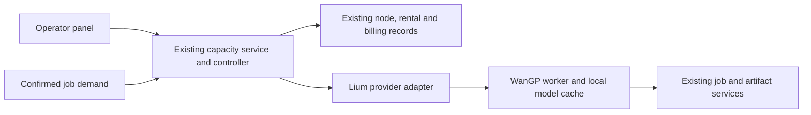

# RTX 5090 / INT8 pilot and operator-panel proposal

Date: 2026-10-08. Owner: [D2 #22](https://github.com/apedintensor/h3-studio/issues/22). Related: [prepared image #61](https://github.com/apedintensor/h3-studio/issues/61), [REF #29](https://github.com/apedintensor/h3-studio/issues/29), [capacity #5](https://github.com/apedintensor/h3-studio/issues/5), [public lifecycle #16](https://github.com/apedintensor/h3-studio/issues/16).

**Status:** The user selected RTX 5090 and INT8 for future inexpensive FL2VA/Ref2VA tests. The exact pruning choice, RAM threshold, experimental limits, image comparison and panel below are **proposals for review**. This document does not enable generation, authorize this experiment to start, or qualify a new recipe. No GPU was rented and no weights/image were downloaded or built for this research. Existing BF16 jobs, manifests, recovery obligations and evidence stay unchanged. See DEC-011.

## 1. Proposed configuration

Use pinned WanGP through the existing Sixnine adapter. Start with **one single-GPU node**, adding a second suitable node for startup comparison and concurrent requests; maximum two nodes, one active task per node. No tensor parallelism, different engine, expensive-GPU fallback or silent precision substitution.

Recommended inexpensive candidate: **Pruned 20B INT8 ConvRot** for both FL2VA and Ref2VA. Pruning and quantization are separate approximations: the user has selected INT8, but has not yet specifically approved pruning. This proposal visibly names it; do not activate it as if it were the original 33B INT8 model. If pruning is declined, retain the unpruned 33B INT8 pair and run a separately identified recipe. Existing quality/control acceptance does not transfer to either candidate.

Freeze WanGP source `0e58385fbde7ff102d276e4a9e490845de76b4ea`, model repository `DeepBeepMeep/MiniMax-H3`, revision `adc81ccb71352192214d83d5fafb9487e860be39`. Pin component hashes before implementation; the following table records metadata, not installed files. Sizes are decimal GB.

| Component | Exact file / path | GB |
|---|---|---:|
| Proposed FL transformer | `MiniMax-H3-FL2VA-pruned_rank8_int8_convrot.safetensors` | 21.058 |
| Proposed REF transformer | `MiniMax-H3-Ref2VA-pruned_rank8_int8_convrot.safetensors` | 21.058 |
| Shared encoder | `Qwen3-VL-32B-Instruct/Qwen3-VL-32B-Instruct-layer50_quanto_bf16_int8.safetensors` | 26.724 |
| Video VAE | `minimax_h3/minimax_h3_video_vae_int8_convrot.safetensors` | 2.811 |
| Audio VAE, FP32 | `MiniMax-H3-audio_vae_fp32.safetensors` | 0.605 |
| Latent upscaler, BF16; loader also loads it | `minimax_h3/minimax_h3_latent_upscaler_3d_bf16.safetensors` | 0.691 |
| Unpruned alternative FL | `MiniMax-H3-FL2VA_int8_convrot.safetensors` | 34.039 |
| Unpruned alternative REF | `MiniMax-H3-Ref2VA_int8_convrot.safetensors` | 34.039 |

One pruned mode plus shared files is approximately **51.89 GB**; both modes cached are **72.95 GB**, plus small tokenizer/config files. Unpruned equivalents are **64.87 / 98.91 GB**. Disk bytes are not RAM/VRAM requirements. “INT8” does not describe the audio VAE or upscaler. Do not silently use the historical NVFP4 encoder in this INT8-encoder cohort.

Keep both transformer files on local disk; activate one mode at a time. Preserve upstream offload/low-memory behavior, explicitly freezing MMGP profile, attention implementation, QKV-splitting/Lower RAM and VAE settings in the candidate manifest. Select supported settings offline first; do not claim a qualified value merely because it exists in upstream. Do not force both transformers and encoder to remain in RAM or VRAM. Mode switching must release the previous working set, retain disk files and preserve job identity.

## 2. Machine admission and Lium filtering

**Pilot minimum: 96 GiB actually allocatable RAM; preferred: 128 GiB.** This is a conservative planning threshold for the new encoder/REF combination, not a measured minimum or a promise that all workloads fit. Historical ~91 GiB container FL success used a different encoder and does not qualify REF. A 64 GiB experiment is deferred until this baseline is measured.

| Property | Proposed admission / ranking |
|---|---|
| GPU | Exact RTX 5090; one GPU allocated; nominal 32 GB VRAM; inspect actual `nvidia-smi` memory and architecture |
| Rental granularity | `available_gpu_count >= 1`, `min_rentable_gpu_count == 1`; prefer `gpu_count == 1` |
| RAM | Estimate allocated share before rental, then verify host MemTotal and container/cgroup effective limit; at least 96 GiB effective capacity and adequate current headroom |
| CPU | At least 12 allocated logical CPUs; prefer 16–24, no need to pay for 64 |
| Disk | At least 250 GiB usable free on the actual model-cache filesystem; prefer 300+ GiB and local NVMe; unknown disk type needs verification, not automatic classification as HDD |
| Network | Measured advertised download >=500 Mbps; prefer >=1 Gbps. Record actual Hugging Face throughput separately |
| Price | At most $0.85 per single-GPU hour for this first pilot; rank qualified candidates by expected total preparation plus execution cost, not ask price alone |
| Reliability | Prefer >=95/100; unknown is unverified, not zero. Prefer secure over preemptible spot for the primary baseline |
| Image/driver | Exact selected image digest and supported NVIDIA driver/CUDA combination; CUDA versions compared as versions, not decimals |
| Region | Rank by measured registry/HF transfer and service connectivity; do not hard-code one executor/city |

Use the official unauthenticated [public feed](https://lium.io/api/public/v1/nodes), checking `generated_at`. It is inventory evidence, not a reservation. Per [Lium field definitions](https://docs.lium.io/developers/public-nodes-feed), CPU, RAM, disk and free disk are **whole-node** values; partial GPU rentals receive proportional shares. Estimate share as requested GPUs / node GPUs, then confirm allocation through the existing provider adapter before creating one rental. Do not confuse public node IDs with rental IDs or fabricate field mappings. Null required fields remain unverified and do not pass numeric gates. Refresh once per minute while actively selecting; revalidate quote/availability immediately before the existing rental-intent transaction.

GB versus GiB is explicit: 96 GiB = 103.08 decimal GB. The provider feed's `ram_gb` must be normalized using verified units rather than assumed to be cgroup memory. A nominal 110 GB node is a candidate, not proof of a 96 GiB container allocation. Multi-GPU hosts may qualify for one GPU only when the allocated CPU/RAM/disk share passes all gates.

Observed public snapshot `2026-10-08T09:00:50.889417Z` (48 nodes):

| Candidate | GPU allocation / feed RAM / CPU | Free disk; download | Ask | Assessment |
|---|---|---|---:|---|
| Almaty, `1c760015-0b97-478f-b595-9bec535083c9` | 1/1; 110 GB; 14 | 1578 GB, type unknown; 861.6 Mbps | $0.75/h | RAM candidate; reliability 98.7; verify actual memory, disk and tier |
| Ploiesti, `a72a75b7-5161-45d3-ac6b-356a112cf00e` | 1/1; 94 GB; 18 | 490 GB NVMe; 1844.5 Mbps | $0.64/h | Better network but below conservative pilot RAM gate; reserve for later measured lower-RAM test |
| Other observed single-card offers | 30–78 GB RAM | Varied | $0.64–0.85/h | Do not select for this baseline merely because cheap |

An earlier snapshot had two 110 GB candidates; this one has one. The plan is **up to two**, not “rent any second machine.” If only one qualifies, run serial qualification first and label the two-node comparison pending. If none qualifies, expose filter rejection reasons and leave demand pending; never silently broaden to B200/PRO6000 or lower RAM. Distinct node IDs do not prove separate physical/provider fault domains.

## 3. Startup comparison

Avoid paying a GPU to build an image. Resolve source/import compatibility and package the worker on a CPU builder before the pilot. No registry charge or publication is assumed authorized by this planning task. Keep source/dependency/image identity separate from the model cache.

| Candidate | Purpose | Remaining cold cost |
|---|---|---|
| A: existing prebuilt WanGP image plus the pinned Sixnine worker package at start | Low-effort baseline; no repeated multi-GB environment archive | Image pull, small worker initialization, weights and model load |
| B: same base-image digest with the same worker/dependencies installed in a thin image layer | Proposed production candidate; eliminates runtime worker installation | Derived-image pull, weights and model load |
| Current 5.48 GB dependency archive/install path | Historical control only; do not pay to replay a known expensive setup by default | Existing setup costs in dated receipts |

An exact-source prebuilt candidate exists: `vastai/wan2gp:0e58385-2026-10-06-cuda-12.9`, index digest `sha256:27ef0628d6b4ea24d7263efd8bdb13eb8033de62aa06dfe342e82b8c434ae14c`; Linux amd64 manifest `sha256:ebd7ed5559bfc7158d7e6a8989d9d2661dea67748fac0c8c6b95f62eb4a358dd`; reported compressed size ~7.73 GB. [Registry metadata](https://hub.docker.com/v2/repositories/vastai/wan2gp/tags/0e58385-2026-10-06-cuda-12.9) checked 2026-10-08. This is a Vast-maintained image candidate, not a qualified Lium template or an exact reproduction of our old Python/PyTorch environment. Verify contents, startup behavior, complete dependencies and licenses/provenance; disable any runtime self-update. Run our headless worker rather than exposing the upstream UI.

Bind actual provider image/template observations to the immutable digest under #61. A mutable tag, a directory named `prepared_root`, a cached-image label, or import success alone cannot establish the running image/recipe. If A and B cannot share source, dependencies and models, report an end-to-end deployment comparison, not the isolated benefit of preinstallation. Do not block useful single-node results waiting for an unavailable second matching node.

Even identical software pins do not control cross-node CPU, RAM, disk, network, power or cache differences. This one-run pair is descriptive deployment evidence only: it cannot isolate the effect of preinstallation or establish a universally faster image. Record those differences and freeze the second-mode background-download schedule/limits across both arms. A controlled same-host/crossover comparison is a later option only if causal attribution is needed; do not add paid repeats to this pilot by default.

Startup stages: provision → container/image → lightweight environment/identity check → shared components and requested-mode weights ready → model load/encode → original confirmed job → output persistence. Cache the second mode in the background at bounded priority without delaying first-job inference or exhausting RAM. Report `FL available / REF downloading` honestly; file-ready, engine-ready and successful-output are separate observations. Per-boot checks do not generate three qualification videos. This finite experiment's samples constitute qualification of the new recipe; ordinary subsequent starts reuse that qualification and execute actual accepted work.

Store weights on the verified local disk cache, keyed by revision/file hash. Process restart reuses this cache. A new rental may have no cache: no persistent-local-disk guarantee is inferred after destruction, and this phase does not add an S3/external-volume download dependency. Including weights in an image or buying persistent storage is a later measured option, not needed to begin this pilot.

## 4. Measure time honestly

Record wall-clock timestamps and overlapping intervals for provider readiness, image pull, dependency work, weights fetch/verification, CPU loading, GPU transfer, reference encoding, denoise, video/audio decode, mux, business upload and downloadable result. Also record downloaded bytes, effective throughput, process RSS/cgroup memory, VRAM peak, actual disk/mount and recipe identities. Do not sum overlapping phases or report “weights downloaded” as “model loaded.”

Separate these conditions:

1. Fresh node: image and model cache misses as observed.
2. Same node/process restart: model files cached, weights must load again.
3. Warm same-mode task: model resident to the extent supported by offload.
4. FL → REF → FL: model-switch cost, with no repeated weight download.

At an ideal sustained 100 MB/s, downloading 51.89 GB takes 8.65 minutes before overhead; both pruned modes 72.95 GB take 12.16 minutes. At 50 MB/s, those become 17.30 / 24.32 minutes. This makes an unconditional sub-10-minute fresh-node promise inappropriate. The 861.6 Mbps advertised node speed is not actual HF throughput. Preinstallation cannot remove weight-transfer or load time.

Historical 5090 Base20 ~265 s and Base50 ~643 s at 768p/124 frames were a different Comfy/encoder configuration. They provide context, not speed promises for the new WanGP recipe. Report per-output compute cost, whole-rental cost (including failure/idle/preparation), and cost per manually accepted output separately. A tiny pilot cannot establish p95 or a production SLA.

## 5. Minimal functional matrix

Baseline output: 832x480, native 124 frames at 24 fps (~5.167 s), audio on, batch one; identical sampler/attention/offload/VAE/seed for matched comparisons. Use Base20 for inexpensive discovery and Base50 explicitly for controls/step coverage; do not enable Turbo, PDD, VDN, LoRA or skip-step cache. All inputs are existing authorized synthetic fixtures. Record the exact fixture hashes privately, not user prompts or media on GitHub.

| Test | Execution | Proof sought |
|---|---|---|
| 1–2 | A and B each same FL text-only Base20 task | Cold startup comparison; one useful sample each |
| 3 | Chosen node, fresh prompt FL20 warm | Same-mode reuse without mistaking prompt cache for all warm gains |
| 4 | Same node switch to REF20; one image | Image reference encoding / first mode switch |
| 5 | REF20; one ~2 s video with its audio stripped | Video encoder path independent of embedded audio |
| 6 | REF20; one image + one ~2 s separate audio | Independent audio reference path; audio-only is not a valid pinned-WanGP reference combination |
| 7 | REF20; image + silent video + separate audio | Mixed reference path |
| 8 | Switch back FL20; first + last images | Mode switching, endpoints and preservation of native ending |
| 9–10 | Concurrent on different nodes: FL first+last50 and REF mixed50 | Steps preserved and two independent jobs; compare FL to #8 and REF to #7 |
| Optional 11–12 | Winner: FL20 then REF mixed20 at 1344x768, otherwise same | Explicit higher-resolution boundary, only while budget and TTL headroom remain |

Run the full matrix once on the chosen startup candidate; the other machine only supplies matched startup and concurrent-task evidence. Do not run two full matrices. REF step50 can be on the second node for concurrency, but cross-node latency is not a pure step-count comparison. If only one node qualifies, run these tasks serially and leave concurrency unverified. After main samples, restart only the idle worker on one retained node and measure disk-cached readiness; submit the next scheduled sample if available, not a redundant extra qualification batch.

Pinned upstream validation allows up to 9 images, 3 videos, 3 audio files and 12 total references; audio count cannot exceed image plus video count. These are parser limits, not a proven 5090 execution envelope. This pilot deliberately qualifies small references. Max-count, long-duration, 15-second, portrait, timed-guide and other advanced-control combinations remain unverified until separately tested. FL start/end conditioning and REF conditioning remain distinct recipes; do not combine incompatible inputs in one request.

Technical success requires the original job/attempt, complete video + required independent audio, full decode, checksum, native duration/frame provenance, owner retrieval and preserved files after node removal. Review first/last frames, obvious visual continuity and whether references/audio influence the result; listening/quality judgments must be identified as such. No VBench or complete-control/quality-parity claim from these samples.

## 6. Proposed finite limits and stopping behavior

- Maximum two concurrent single-card rentals, $0.85/card-hour, two hours per node from original rental creation; at most four aggregate GPU-hours. Nominal GPU ceiling is $3.40; suggest a $5 pilot GPU spending limit including reconciliation margin. This is a proposed limit, not a claim that provider TTL mathematically guarantees a final bill. Additional storage/registry fees require a known price before use. No automatic extensions, replacement leases or larger GPU.
- At 10 minutes not ready, record the limiting stage and actual progress; do not restart a healthy download. At 30 minutes without usable runtime, stop adding sample work, collect diagnostics and safely retire after reconciling whether anything is active. This is a finite pilot threshold, not an accepted production latency policy.
- Stop the matrix on OOM, wrong component/precision, missing independent audio, duplicate attempts or an unknown rental/start/stop outcome. Keep original jobs, costs and evidence; do not silently lower settings. Repair before a targeted re-test within a separately checked remaining budget.
- Do not start another job without sufficient measured runtime plus collection margin before hard TTL. Collect and verify outputs continuously. After tests, drain, persist all artifacts, destroy exact owned instances, and verify removal and supplier billing through the provider API. A stop request or empty inventory response is not proof of final settlement.

## 7. Operator panel after selection

**Yes: a small operator panel is worthwhile.** It makes configuration, preparation, failure and bills visible. It does not fix model/runtime failures by itself, and it must reuse the existing capacity authority.

First panel scope:

- Pool header: desired/ready/busy/preparing node counts, budget spent/reserved/estimated versus supplier-settled charges, active policy and candidate-filter rejection counts.
- Node card: advertised versus verified GPU/VRAM/RAM/cgroup/CPU/disk/network; price, region/provider identity, original creation/TTL, current image/recipe; FL/REF files cached, mode loaded, capabilities actually qualified; current phase with bytes/progress/timestamps, heartbeat, safe error and owned job link.
- Actions: start one / start up to two using the approved filter; refresh candidates; open logs with secrets/media redacted; stop accepting work (drain), then stop after outputs and obligations are safe. Forced cancellation is a separate explicit operation, never disguised as normal shutdown. “No qualifying capacity” returns concrete causes to the operator and truthful waiting status to clients.
- Manual starts are an explicit bounded capacity demand/hold with expiry. Automatic demand and manual demand share one idempotent service/ledger and maximum-instance policy. A double click or concurrent autoscaler must not create duplicate rentals. Manual hold expiry returns to normal idle policy; unknown/running/output-collection obligations prevent idle shutdown.
- Normal eventual policy remains 600 seconds without pool obligations. The pilot's two-hour TTL is not a production lifetime. The panel cannot reset historical spend/lease deadlines by editing a filter. It does not expose Lium credentials, SSH keys or arbitrary shell access to browser users.
- Owner/administrator authorization only; ordinary creative Agent keys retain job/asset access, not rental authority. Operator API commands can be added around existing application services; path names and schemas will be frozen during implementation rather than advertised here as existing endpoints.

Implementation order after proposal review: (1) explicit INT8 recipe/compiler/manifest mapping and offline validation; (2) #61 image identity and CPU-built package; (3) bounded single-node FL/REF pilot and optional second-node comparison; (4) operator read-only inventory/stage/cost view; (5) start/drain/stop commands using the same authority, idempotency and recovery tests; (6) qualify two-node demand and idle behavior before production enablement. Do not make the UI a prerequisite to cheap runtime qualification.

## 8. Review gates and sources

Before renting: review model pruning choice and this finite experiment; inspect latest #22/#29/#61 claims and production authorization; verify no existing matching rentals/unknown obligations are being duplicated; ensure exact image/recipe manifests and offline adapter checks pass. Selecting a WanGP filename alone does not make the current BF16 compiler accept INT8. No public capability should be advertised before the new recipe's corresponding output/control evidence.

Deliverable after the eventual pilot: selected configuration or explicit failure boundary, phase timings, peak RAM/VRAM, cold/warm/mode-switch behavior, sample index, per-mode validation, actual costs and verified removal. Keep results in existing issue acceptance evidence, not a second project status database.

Sources inspected 2026-10-08:

- [Pinned FL pruned defaults](https://github.com/deepbeepmeep/Wan2GP/blob/0e58385fbde7ff102d276e4a9e490845de76b4ea/defaults/minimax_h3_fl2va_pruned.json), [REF pruned defaults](https://github.com/deepbeepmeep/Wan2GP/blob/0e58385fbde7ff102d276e4a9e490845de76b4ea/defaults/minimax_h3_ref2va_pruned.json).
- [Pinned H3 loader](https://github.com/deepbeepmeep/Wan2GP/blob/0e58385fbde7ff102d276e4a9e490845de76b4ea/models/minimax_h3/minimax_h3_main.py), [handler/validation](https://github.com/deepbeepmeep/Wan2GP/blob/0e58385fbde7ff102d276e4a9e490845de76b4ea/models/minimax_h3/minimax_h3_handler.py), [component metadata](https://huggingface.co/api/models/DeepBeepMeep/MiniMax-H3/tree/adc81ccb71352192214d83d5fafb9487e860be39?recursive=true&limit=1000).
- [Vast image recipe](https://github.com/vast-ai/base-image/blob/main/derivatives/pytorch/derivatives/wan2gp/Dockerfile), [Lium templates](https://docs.lium.io/pod-users/templates), and public feed/schema linked above. Availability and mutable web documents are dated observations.
- Historical context and receipt paths: [economics research](README.md#5-our-historical-measurements-and-their-limits). Historical 5090 evidence used other components; current WanGP INT8 REF, image compatibility, true minimum RAM and startup speed remain unverified.
